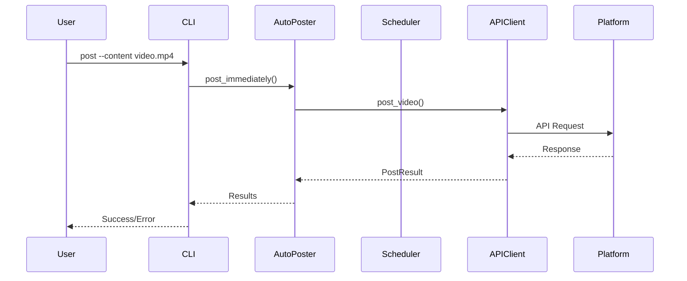
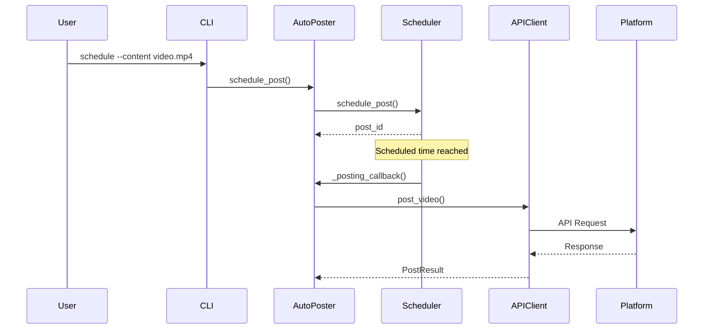
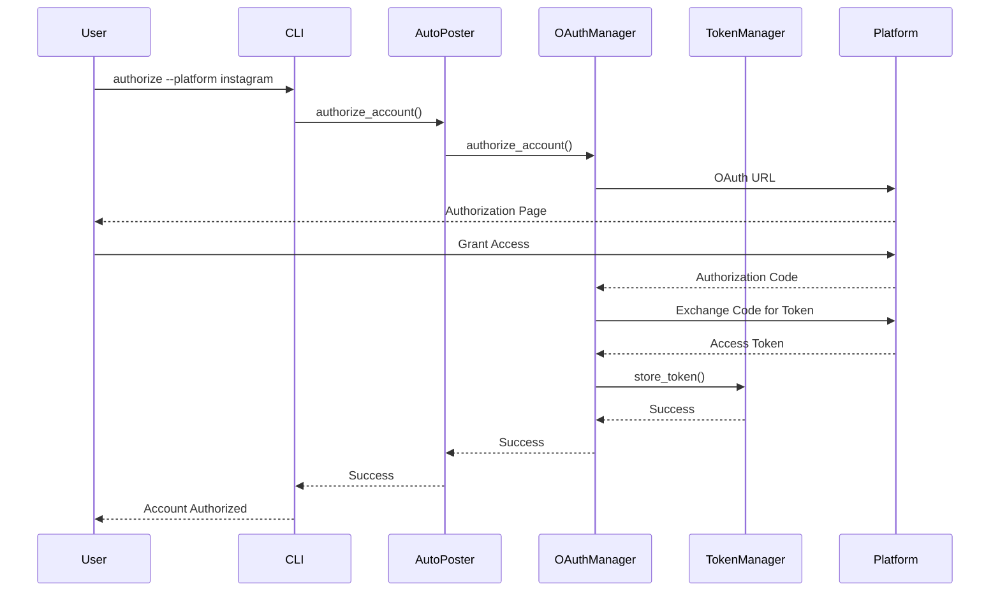

# Content Fabric - Архитектура системы

## Обзор архитектуры

Content Fabric построен по модульной архитектуре с четким разделением ответственности между компонентами. Система использует паттерн "Facade" для упрощения взаимодействия с различными API социальных сетей.

## Диаграмма архитектуры

```
┌─────────────────────────────────────────────────────────────────┐
│                        CLI Interface                            │
│                    (main.py, account_manager.py)                │
└─────────────────────┬───────────────────────────────────────────┘
                      │
┌─────────────────────▼───────────────────────────────────────────┐
│                SocialMediaAutoPoster                            │
│                    (Facade)                                     │
└─────┬─────────┬─────────┬─────────┬─────────┬───────────────────┘
      │         │         │         │         │
      ▼         ▼         ▼         ▼         ▼
┌─────────┐ ┌─────────┐ ┌─────────┐ ┌─────────┐ ┌─────────────┐
│Scheduler│ │TokenMgr │ │OAuthMgr │ │NotifMgr │ │ConfigLoader │
└─────────┘ └─────────┘ └─────────┘ └─────────┘ └─────────────┘
      │         │         │         │         │
      ▼         ▼         ▼         ▼         ▼
┌─────────────────────────────────────────────────────────────────┐
│                    API Clients Layer                           │
│  ┌─────────────┐ ┌─────────────┐ ┌─────────────┐              │
│  │Instagram    │ │TikTok       │ │YouTube      │              │
│  │Client       │ │Client       │ │Client       │              │
│  └─────────────┘ └─────────────┘ └─────────────┘              │
└─────────────────────────────────────────────────────────────────┘
      │         │         │
      ▼         ▼         ▼
┌─────────────────────────────────────────────────────────────────┐
│                    External APIs                               │
│  ┌─────────────┐ ┌─────────────┐ ┌─────────────┐              │
│  │Instagram    │ │TikTok       │ │YouTube      │              │
│  │Basic Display│ │for Developers│ │Data API v3  │              │
│  └─────────────┘ └─────────────┘ └─────────────┘              │
└─────────────────────────────────────────────────────────────────┘
```

## Детальное описание компонентов

### 1. Слой представления (Presentation Layer)

#### CLI Interface
- **main.py**: Основной CLI интерфейс с командами для публикации и управления
- **account_manager.py**: Специализированный CLI для управления аккаунтами

**Основные команды:**
```bash
# Публикация
python main.py post --content video.mp4 --caption "Hello!" --platforms "instagram,tiktok"

# Планирование
python main.py schedule --content video.mp4 --caption "Coming soon!" --platforms "instagram"

# Управление аккаунтами
python account_manager.py status
python account_manager.py authorize --all
```

### 2. Слой бизнес-логики (Business Logic Layer)

#### SocialMediaAutoPoster (Facade)
**Роль**: Центральный координатор системы

**Ключевые методы:**
- `post_immediately()`: Немедленная публикация
- `schedule_post()`: Планирование публикации
- `validate_accounts()`: Валидация аккаунтов
- `authorize_account()`: Авторизация аккаунтов

**Паттерны:**
- **Facade**: Упрощает взаимодействие с подсистемами
- **Strategy**: Выбор API клиента в зависимости от платформы

### 3. Слой управления данными (Data Management Layer)

#### TokenManager
**Ответственность**: Управление токенами доступа

**Функции:**
- Безопасное хранение токенов
- Автоматическое обновление истекших токенов
- Шифрование чувствительных данных

**Структура данных:**
```python
@dataclass
class TokenInfo:
    platform: str
    account_name: str
    access_token: str
    refresh_token: Optional[str]
    expires_at: Optional[datetime]
    scope: Optional[str]
    created_at: datetime
    last_refreshed: Optional[datetime]
```

#### OAuthManager
**Ответственность**: OAuth авторизация

**Функции:**
- Генерация URL авторизации
- Обработка OAuth callback'ов
- Управление правами доступа

#### ConfigLoader
**Ответственность**: Загрузка и валидация конфигурации

**Функции:**
- Парсинг YAML конфигурации
- Подстановка переменных окружения
- Валидация настроек

### 4. Слой планирования (Scheduling Layer)

#### PostingScheduler
**Ответственность**: Планирование и выполнение публикаций

**Функции:**
- Управление очередью публикаций
- Поддержка различных типов расписания
- Обработка отмененных постов

**Типы расписания:**
- Конкретное время: `"2024-01-15T18:00:00"`
- Случайные интервалы: `start: "08:00", end: "10:00"`
- Дни недели: `[0, 1, 2, 3, 4, 5, 6]`

### 5. Слой уведомлений (Notification Layer)

#### NotificationManager
**Ответственность**: Отправка уведомлений

**Каналы:**
- Telegram Bot API
- SMTP Email

**Типы уведомлений:**
- Успешная публикация
- Ошибка публикации
- Сводный отчет
- Тестовые уведомления

### 6. Слой интеграции (Integration Layer)

#### API Clients
**Базовый класс**: `BaseAPIClient`

**Общая функциональность:**
- HTTP запросы с retry логикой
- Обработка rate limits
- Логирование API вызовов
- Обработка ошибок

**Специализированные клиенты:**

##### InstagramClient
- **API**: Instagram Basic Display API
- **Аутентификация**: OAuth 2.0
- **Ограничения**: ~200 запросов/час

##### TikTokClient
- **API**: TikTok for Developers
- **Аутентификация**: OAuth 2.0
- **Ограничения**: Зависят от endpoint'а

##### YouTubeClient
- **API**: YouTube Data API v3
- **Аутентификация**: OAuth 2.0
- **Ограничения**: 10,000 quota units/день

## Потоки данных

### 1. Поток публикации контента



### 2. Поток планирования публикации



### 3. Поток авторизации аккаунта



## Паттерны проектирования

### 1. Facade Pattern
**Применение**: `SocialMediaAutoPoster`
**Цель**: Упрощение сложного взаимодействия с подсистемами

### 2. Strategy Pattern
**Применение**: Выбор API клиента в зависимости от платформы
**Цель**: Инкапсуляция алгоритмов публикации для каждой платформы

### 3. Observer Pattern
**Применение**: Уведомления о результатах публикации
**Цель**: Слабая связанность между компонентами

### 4. Factory Pattern
**Применение**: Создание API клиентов
**Цель**: Инкапсуляция логики создания объектов

### 5. Singleton Pattern
**Применение**: Логгеры и конфигурация
**Цель**: Единственный экземпляр критически важных компонентов

## Обработка ошибок

### 1. Retry Logic
- **Экспоненциальная задержка**: 2^attempt секунд
- **Максимальные попытки**: 3
- **Исключения**: 4xx ошибки (кроме 429)

### 2. Rate Limiting
- **Автоматическое ожидание**: При достижении лимитов
- **Retry-After заголовок**: Соблюдение рекомендаций API
- **Мониторинг**: Отслеживание оставшихся запросов

### 3. Graceful Degradation
- **Частичные сбои**: Продолжение работы при ошибках отдельных платформ
- **Fallback механизмы**: Альтернативные способы выполнения операций
- **Уведомления**: Информирование о проблемах

## Безопасность

### 1. Управление секретами
- **Переменные окружения**: Все секреты в `.env`
- **Шифрование токенов**: При хранении в файловой системе
- **Валидация конфигурации**: Проверка корректности настроек

### 2. API Security
- **HTTPS**: Все API вызовы по защищенному соединению
- **Токены доступа**: OAuth 2.0 для аутентификации
- **Обновление токенов**: Автоматическое обновление истекших токенов

### 3. Логирование безопасности
- **Аудит**: Логирование всех операций с токенами
- **Мониторинг**: Отслеживание подозрительной активности
- **Ротация логов**: Автоматическая ротация лог-файлов

## Масштабируемость

### 1. Горизонтальное масштабирование
- **Независимые компоненты**: Возможность запуска на разных серверах
- **Очереди задач**: Использование внешних систем очередей
- **Балансировка нагрузки**: Распределение нагрузки между экземплярами

### 2. Вертикальное масштабирование
- **Оптимизация ресурсов**: Эффективное использование памяти и CPU
- **Кэширование**: Кэширование часто используемых данных
- **Асинхронность**: Асинхронная обработка задач

### 3. Мониторинг и метрики
- **Производительность**: Отслеживание времени выполнения операций
- **Использование ресурсов**: Мониторинг памяти, CPU, диска
- **Бизнес-метрики**: Количество публикаций, успешность операций

