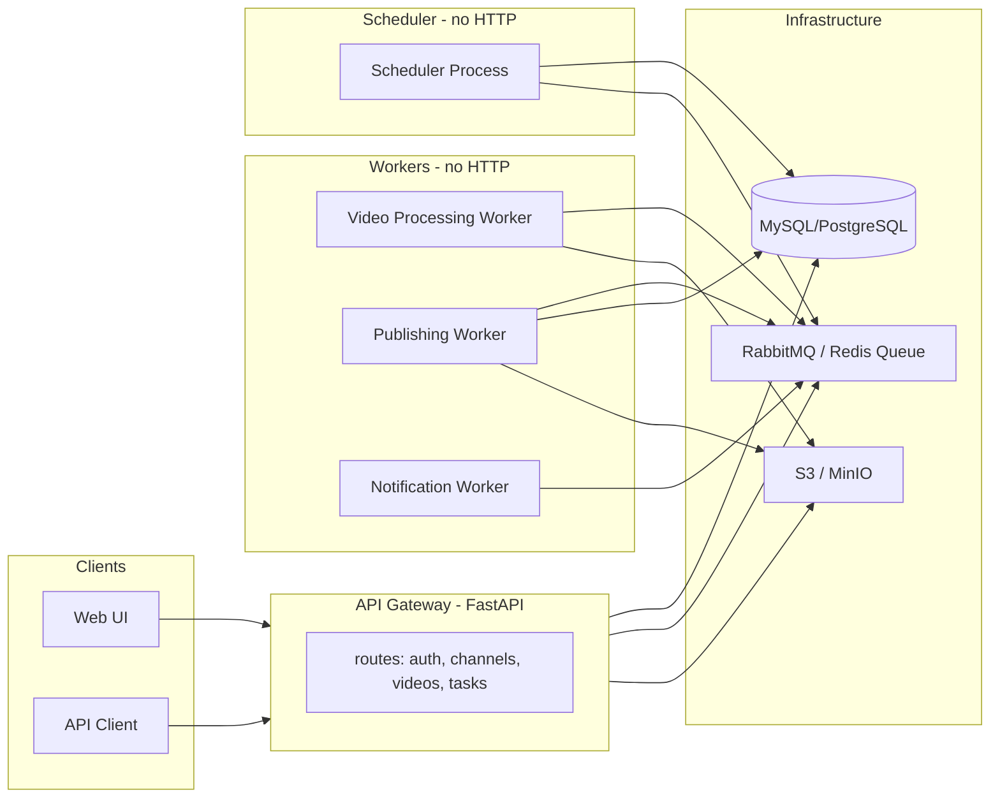

# План: микросервисы в prod и распил legacy

## Ответ на главный вопрос: нужен ли отдельный FastAPI для каждого сервиса?

**Нет.** По [DESIGN_DOC.md](docs/DESIGN_DOC.md) (раздел 3.1–3.2):

- **HTTP API нужен только там, где есть внешние запросы:** API Gateway и Auth Service.
- **Video Processing Worker, Publishing Worker, Scheduler, Notification Service** — это **процессы-воркеры/демоны**: они слушают очередь (RabbitMQ/Redis) или таймер (Celery Beat/APScheduler), а не HTTP. Для них отдельное FastAPI-приложение не требуется.

Итого по типам компонентов:


| Компонент               | Нужен ли FastAPI                                   | Что это                                                                                    |
| ----------------------- | -------------------------------------------------- | ------------------------------------------------------------------------------------------ |
| API Gateway             | Да, один общий FastAPI app                         | Единая точка входа: channels, videos, tasks, upload, прокси/вызов Auth                     |
| Auth Service            | Опционально отдельный FastAPI или модуль в Gateway | register, login, refresh, OAuth, JWT                                                       |
| Video Processing Worker | Нет                                                | Python-процесс, consumer очереди (Celery/RQ/RabbitMQ)                                      |
| Publishing Worker       | Нет                                                | Python-процесс, consumer очереди                                                           |
| Scheduler               | Нет                                                | Процесс с Celery Beat или APScheduler (раз в минуту опрос БД → постановка задач в очередь) |
| Storage                 | Нет (как сервис)                                   | Клиент S3/MinIO в коде API и воркеров; отдельный HTTP-сервис не обязателен                 |
| Notification            | Нет (для MVP)                                      | Воркер: забирает из очереди и шлёт email/Telegram                                          |


**Рекомендация:** в `/prod` иметь **один FastAPI app** (API Gateway), который объединяет роуты для channels, videos, tasks, auth (как модули), плюс **отдельные точки входа (entrypoints)** для воркеров и планировщика — без своего FastAPI, просто `python -m prod.workers.video_worker` и т.п.

---

## Целевая архитектура (по дизайн-доку)




- Один HTTP-сервис: **API Gateway (FastAPI)**.
- Остальное: **процессы** (воркеры + планировщик), без своего FastAPI.

---

## Соответствие legacy → prod


| Legacy                                                 | Назначение в prod                                                                                               |
| ------------------------------------------------------ | --------------------------------------------------------------------------------------------------------------- |
| `app/main.py` (CLI SocialMediaAutoPoster)              | Логика частично в API (schedule, cancel, list) + Scheduler/Worker                                               |
| `app/scheduler.py` (PostingScheduler, in-memory/JSON)  | Заменить на Scheduler по БД: опрос `tasks` где `date_post <= NOW()`, создание job в очередь                     |
| `app/task_worker.py` (TaskWorker)                      | Разделить: **Scheduler** (опрос БД → очередь) и **Publishing Worker** (очередь → YouTube upload, обновление БД) |
| `scripts/youtube_reauth_service.py`                    | Вынести в общую библиотеку, вызывать из Publishing Worker и/или отдельного CLI/сервиса reauth                   |
| `core/database/mysql_db.py`                            | Перенести в prod (адаптеры/репозитории), использовать из API и воркеров                                         |
| `core/api_clients/youtube_client.py`                   | Перенести в prod, использовать в Publishing Worker                                                              |
| `core/auth/reauth/`                                    | Перенести в prod, использовать в Publishing Worker и reauth                                                     |
| `core/voice/` (VoiceChanger, RVC, Silero)              | Перенести в prod как библиотеку для **Video Processing Worker**                                                 |
| `core/cpp/` (видео pipeline)                           | Подключить из Video Processing Worker (subprocess или shared lib)                                               |
| `core/utils/notifications.py`, `telegram_broadcast.py` | Notification Worker + общая библиотека                                                                          |
| `run_task_worker.py`, `run_youtube_manager.py`, и т.д. | Заменить на единые entrypoints в prod (см. ниже)                                                                |


---

## Структура репозитория `/prod` (предлагаемая)

Цель: один кодовая база, несколько **запускаемых процессов** (один из них — FastAPI).

```
prod/
├── app/                    # API Gateway (FastAPI)
│   ├── main.py             # FastAPI app, include_router
│   ├── api/
│   │   ├── routes.py
│   │   └── endpoints/
│   │       ├── auth.py
│   │       ├── channels.py
│   │       ├── videos.py
│   │       └── tasks.py
│   ├── core/
│   │   ├── config.py
│   │   ├── database.py
│   │   └── security.py      # JWT, OAuth (или вызов Auth Service)
│   ├── schemas/
│   ├── repositories/
│   └── services/
├── workers/                # Воркеры (не FastAPI)
│   ├── __init__.py
│   ├── video_worker.py     # entrypoint: очередь → обработка видео (voice, cpp pipeline)
│   ├── publishing_worker.py # entrypoint: очередь → YouTube upload, обновление tasks
│   └── notification_worker.py # entrypoint: очередь → email/Telegram
├── scheduler/              # Планировщик (не FastAPI)
│   ├── __init__.py
│   └── run.py              # APScheduler/Celery Beat: раз в N сек опрос БД → publish queue
├── shared/                 # Общий код для API и воркеров
│   ├── db/                 # адаптеры к MySQL, модели, миграции
│   ├── queue/              # подключение к RabbitMQ/Redis, объявление очередей
│   ├── storage/            # S3/MinIO клиент
│   ├── youtube/            # перенос core/api_clients/youtube_client + auth/reauth
│   ├── voice/              # перенос core/voice (или симлинк/подмодуль на legacy/core/voice)
│   └── notifications/      # перенос core/utils (notifications, telegram)
├── main.py                 # Запуск API Gateway: uvicorn
├── requirements.txt
├── Dockerfile              # образ для API
├── docker-compose.yml      # api + workers + scheduler + mysql + rabbitmq + minio
└── migrations/
```

Важно:

- **Один FastAPI app** — в `app/main.py`, монтирует все роуты (auth, channels, videos, tasks).
- **Воркеры и Scheduler** — отдельные скрипты/модули с `if __name__ == "__main__"` или через `celery -A prod.workers worker`, без своего FastAPI.

---

## Этапы распила legacy и реализации в prod

### Этап 1: Инфраструктура и общий код (shared)

- Добавить в prod очереди (RabbitMQ или Redis + RQ/Celery), описание в `shared/queue/`.
- Вынести конфиг (БД, очереди, S3) в `app/core/config.py` и при необходимости в `shared`.
- Перенести/адаптировать работу с БД из legacy (`core/database/mysql_db.py`, схемы из дизайн-дока) в `prod/shared/db/` (или `app/repositories/` + shared-модели). Единая БД для API, Scheduler и Publishing Worker по дизайн-доку (MySQL для задач).
- Добавить S3/MinIO клиент в `shared/storage/` и использовать для upload/processed в API и воркерах.

### Этап 2: API Gateway (один FastAPI) и Auth

- Оставить/расширить текущий FastAPI в [prod/main.py](prod/main.py) и [prod/app/api/routes.py](prod/app/api/routes.py).
- Добавить модули: auth (register, login, refresh, JWT), videos (upload, status, process), tasks (create, list, cancel). Роуты из дизайн-дока (раздел 3.2.1) реализовать в этом же приложении.
- Auth: либо отдельный микросервис FastAPI (второе приложение), либо модуль внутри этого же Gateway — для MVP достаточно модуля в одном приложении.
- Эндпоинты создают записи в БД и кладут сообщения в очереди (video processing, publishing, notifications), не делая тяжёлую работу сами.

### Этап 3: Scheduler (без FastAPI)

- Реализовать процесс `scheduler/run.py`: по таймеру (например, раз в минуту) запрос к БД — задачи с `status = pending` и `date_post <= NOW()`; для каждой — создание job в очередь публикации (и при необходимости обновление статуса).
- Заменить логику из legacy `app/scheduler.py` (in-memory/JSON) на эту схему. Данные о задачах хранить только в БД (как в legacy `task_worker` + дизайн-док).

### Этап 4: Publishing Worker (без FastAPI)

- Перенести из legacy [app/task_worker.py](legacy/app/task_worker.py) и [core/api_clients/youtube_client.py](legacy/core/api_clients/youtube_client.py) логику: взять задачу из очереди → загрузить видео на YouTube → обновить задачу в БД.
- Вынести в `shared/youtube/` клиент YouTube, обновление токенов и reauth (перенос [core/auth/reauth](legacy/core/auth/reauth), [scripts/youtube_reauth_service.py](legacy/scripts/youtube_reauth_service.py)).
- Entrypoint: один процесс (например, `python -m prod.workers.publishing_worker` или Celery worker), без HTTP.

### Этап 5: Video Processing Worker (без FastAPI)

- Перенести из legacy [core/voice](legacy/core/voice) (VoiceChanger, RVC, Silero) в `shared/voice/` и при необходимости вызывать C++ pipeline из [core/cpp/video](legacy/core/cpp/video) через subprocess или shared library.
- Реализовать `workers/video_worker.py`: забирает job из очереди (video_id, настройки), качает файл из S3, запускает обработку (голос, субтитры, водяные знаки), заливает результат в S3, обновляет статус в БД, ставит в очередь уведомление.
- Отдельный FastAPI для этого воркера не создавать.

### Этап 6: Notification Worker (без FastAPI)

- Перенести [core/utils/notifications.py](legacy/core/utils/notifications.py) и telegram-логику в `shared/notifications/`.
- Реализовать `workers/notification_worker.py`: consumer очереди уведомлений → отправка email/Telegram/webhook по типу события.
- Для MVP можно вызывать те же функции синхронно из Publishing Worker вместо отдельного воркера, затем вынести в отдельный процесс.

### Этап 7: Запуск и деплой

- **Локально:** `docker-compose up` — один контейнер API (FastAPI), контейнеры для каждого воркера и один для Scheduler. БД, очередь, MinIO в compose.
- **Production:** те же образы: один сервис API, отдельные сервисы для каждого воркера и планировщика (Kubernetes/Systemd/Docker Swarm — без разницы). Для каждого типа процесса — свой Dockerfile или общий образ с разным `CMD` (например, `CMD ["python", "-m", "prod.workers.publishing_worker"]`).

---

## Выбор языка по модулям (Python / Go / C++)

**Кратко:** для высокой пропускной способности достаточно **Python везде**, плюс **C++ только там, где уже есть** (видео pipeline в legacy). Go добавлять не обязательно — выигрыш в throughput при горизонтальном масштабировании небольшой.


| Модуль                       | Рекомендация                | Обоснование                                                                                                                                                                                                                                                                      |
| ---------------------------- | --------------------------- | -------------------------------------------------------------------------------------------------------------------------------------------------------------------------------------------------------------------------------------------------------------------------------- |
| **API Gateway**              | **Python (FastAPI)**        | I/O-bound: HTTP, БД, очередь, S3. Async FastAPI даёт достаточную конкурентность; масштабирование — добавлением реплик за LB. Go дал бы больше req/s на одно ядро, но при горизонтальном масштабировании разница нивелируется, а один стек проще в поддержке.                     |
| **Video Processing Worker**  | **Python + C++ (как есть)** | Тяжёлая работа уже в PyTorch (RVC, Silero — C++/CUDA под капотом), FFmpeg (C), legacy core/cpp/video. Оркестратор на Python (очередь → вызов FFmpeg/PyTorch/C++ pipeline) — нормальная практика. Переписывать ML/voice на Go/C++ нецелесообразно (экосистема, время разработки). |
| **Publishing Worker**        | **Python**                  | I/O-bound: БД, YouTube API, S3. Пропускная способность ограничена в первую очередь лимитами YouTube (1 публикация в минуту на канал, квоты). Больше воркеров дают мало выигрыша; язык не узкое место.                                                                            |
| **Scheduler**                | **Python**                  | Лёгкая нагрузка: раз в минуту запрос к БД + постановка в очередь. Язык не важен.                                                                                                                                                                                                 |
| **Notification Worker**      | **Python**                  | I/O-bound: Email/Telegram API. Python достаточно.                                                                                                                                                                                                                                |
| **Критичные по CPU участки** | **C++ (уже есть)**          | legacy/core/cpp/video — удаление субтитров/водяных знаков, пайплайн. Оставить как есть, вызывать из Python (subprocess или shared lib). Новые тяжёлые алгоритмы при необходимости писать на C++/Rust, но не переписывать весь воркер.                                            |


**Итог по языкам:** единый стек **Python** для API и всех воркеров; **C++** только для уже существующего видео-пайплайна и возможных будущих «горячих» участков. Go вводить только если позже появятся конкретные метрики (например, p99 latency API при 10k RPS) и станет ясно, что узкое место именно в CPU/памяти процесса Gateway.

---

## Дизайн для высокой пропускной способности при большой нагрузке

Цель: система выдерживает рост числа пользователей и пиковые нагрузки без деградации и потери задач.

### 1. Развязка приёма запросов и обработки (очереди)

- **API Gateway** только: валидирует запрос, пишет в БД, кладёт job в очередь и сразу возвращает ответ (например, `202 Accepted` + `task_id`).
- Тяжёлая работа (обработка видео, публикация, уведомления) выполняется **воркерами** из очереди. Пики трафика превращаются в рост длины очереди, а не в таймауты и падения API.
- Очередь (RabbitMQ или Redis Streams) выступает буфером: пропускная способность приложения = «сколько успевает API принять и поставить в очередь» + «сколько воркеров успевают обрабатывать». Оба компонента масштабируются независимо.

### 2. Горизонтальное масштабирование

- **API Gateway:** без состояния (stateless). За LB (nginx, cloud LB) поднимать несколько реплик; каждая обрабатывает любые запросы. Увеличение числа реплик увеличивает пропускную способность по приёму запросов.
- **Воркеры:** несколько инстансов каждого типа (video, publishing, notification). Очередь распределяет задачи между ними. Video Workers обычно нужно больше (CPU/GPU bound); Publishing Workers — меньше (ограничены лимитами YouTube).
- **Scheduler:** один активный инстанс (leader), чтобы не дублировать постановку одних и тех же задач. При использовании Celery Beat или APScheduler в одном процессе этого достаточно; при кластере — leader election (например, через Redis/БД).

### 3. База данных

- **Connection pooling** (например, SQLAlchemy pool, pgBouncer для PostgreSQL) — ограничить число соединений и переиспользовать их.
- **Индексы** по полям, по которым идут выборки: `(user_id, status)`, `(date_post, status)` для задач, `(channel_id, ...)` и т.д. Избегать N+1 (eager load связей где нужно).
- **Read replicas** (если БД одна на всё): чтение списков/аналитики с реплики, запись — в primary. Для MVP можно начать с одной инстанции.

### 4. Кэширование

- **Redis:** сессии (JWT blacklist/whitelist при необходимости), кэш «горячих» данных (например, список каналов пользователя на 1–5 минут), rate limiting (счётчики по user_id/IP). Снижает число обращений к БД и ускоряет ответы API.
- Кэш ответов для редко меняющихся справочников (если появятся) — с TTL и инвалидацией при изменении.

### 5. Асинхронность и быстрый ответ API

- **FastAPI** уже асинхронный; использовать async эндпоинты и async драйверы к БД (asyncpg, aiomysql), чтобы один процесс обрабатывал много одновременных запросов без блокировок на I/O.
- Тяжёлые операции в API не делать: загрузка файла → сохранение в S3 + запись в БД + `queue.publish` → ответ. Обработка файла — только в Video Worker.

### 6. Загрузка файлов и хранилище

- **Прямая загрузка в S3** (presigned URL): клиент по запросу к API получает URL и грузит файл напрямую в S3. API не проксирует бинарные данные — экономия CPU и памяти Gateway, выше пропускная способность.
- **Multipart upload** для больших файлов (как в дизайн-доку) — на стороне клиента и S3; API только выдаёт URL и создаёт запись о видео.

### 7. Rate limiting и защита от перегрузки

- **Rate limiting на уровне Gateway:** по user_id (и при необходимости по IP) — ограничить число запросов в минуту к созданию задач/загрузке, чтобы один пользователь не забил систему.
- **Лимиты из дизайн-дока:** 10 одновременных загрузок на пользователя, 5 одновременных обработок, 1 публикация в минуту на канал — проверять при постановке в очередь и в воркерах.

### 8. Надёжность очередей и задач

- **Идемпотентность обработки:** повторная обработка одного и того же job (при retry) не должна дублировать побочные эффекты (например, проверять по `task_id`, что публикация ещё не выполнена).
- **Retry с exponential backoff** (как в дизайн-доку) — для временных ошибок; после N неудач — в dead-letter очередь и уведомление.
- **Сохранять прогресс** (например, статус видео `processing` с процентами) в БД, чтобы при падении воркера другой инстанс или retry мог продолжить/перезапустить без потери контекста там, где это применимо.

### 9. Мониторинг и масштабирование

- **Метрики:** длина очередей, latency API (p50, p95, p99), ошибки по эндпоинтам, загрузка воркеров. На основе длины очереди video-processing можно автоматически добавлять/убирать инстансы Video Worker (Kubernetes HPA или аналог).
- **Health checks:** `/health` для API и воркеров; при падении — исключение из LB или перезапуск контейнера.
- **Graceful shutdown:** воркеры по SIGTERM дообрабатывают текущую задачу и выходят; новые задачи не забирают. Очередь сохраняет незавершённые задачи для других воркеров.

### 10. Узкие места по дизайн-доку

- **YouTube API:** 10k quota units/день на консоль, 1 публикация в минуту на канал — пропускная способность по публикациям ограничена платформой, а не языком воркера. Масштаб — несколько консолей/аккаунтов и аккуратное распределение задач.
- **Обработка видео:** узкое место — CPU/GPU. Масштабирование: больше инстансов Video Worker, при необходимости GPU-ноды для RVC; параллельная обработка чанков (как в legacy) сохранять.
- **API Gateway:** при очень высоком RPS первым упрётся в CPU/память одного процесса; тогда — больше реплик или рассмотреть Go для Gateway (второй шаг, не первый).

Сводка: высокая пропускная способность достигается за счёт **очередей**, **горизонтального масштабирования** API и воркеров, **кэша**, **асинхронного I/O** и **прямой загрузки в S3**. Выбор Python для всех модулей (с C++ только для существующего видео-пайплайна) такому дизайну не мешает.

---

## Краткие выводы

1. **Отдельный полноценный FastAPI app для каждого микросервиса не нужен.** FastAPI — только для API Gateway (и при желании для отдельного Auth Service).
2. **Воркеры и Scheduler** — обычные процессы (скрипты или Celery workers), слушающие очередь и/или таймер.
3. **Структура prod:** один FastAPI-проект в `app/`, общий код в `shared/`, отдельные модули-точки входа в `workers/` и `scheduler/`.
4. **Распил legacy:** перенос по частям (БД, YouTube, reauth, voice, cpp, notifications) в `shared/` и в соответствующие воркеры; CLI и старый scheduler заменить на API + Scheduler по БД + очереди.

После этого можно переходить к реализации по этапам (сначала shared + API + Scheduler + Publishing Worker, затем Video и Notification workers).