<div align="center">

# Content Fabric (CFF)

### Automated Content Production & Publishing Platform


**Version 3.0** | **Date: 2026-03-21** | **Repository: [mykytatishkin/content-fabric](https://github.com/mykytatishkin/content-fabric)**

---

*Полноцикловая платформа управления видеоконтентом: от обработки и озвучки до публикации и аналитики*

</div>

---

## Table of Contents

- [1. Executive Summary](#1-executive-summary)
- [2. Product Vision & Business Model](#2-product-vision--business-model)
- [3. System Overview](#3-system-overview)
- [4. Infrastructure](#4-infrastructure)
- [5. Service Architecture](#5-service-architecture)
- [6. Request Flow](#6-request-flow)
- [7. Task Lifecycle — Publishing Pipeline](#7-task-lifecycle--publishing-pipeline)
- [8. OAuth & Reauthorization Flow](#8-oauth--reauthorization-flow)
- [9. Directory Structure](#9-directory-structure)
- [10. Database Schema](#10-database-schema)
- [11. API Reference](#11-api-reference)
- [12. Web Portal](#12-web-portal)
- [13. Security Architecture](#13-security-architecture)
- [14. Voice & ML Pipeline](#14-voice--ml-pipeline)
- [15. C++ Video Processing Module](#15-c-video-processing-module)
- [16. Notification System](#16-notification-system)
- [17. Schedule Templates Engine](#17-schedule-templates-engine)
- [18. Tech Stack](#18-tech-stack)
- [19. Team & Responsibilities](#19-team--responsibilities)
- [20. Deployment Guide](#20-deployment-guide)
- [21. Monitoring & Observability](#21-monitoring--observability)
- [22. Testing](#22-testing)
- [23. Configuration Reference](#23-configuration-reference)
- [24. Known Issues & Roadmap](#24-known-issues--roadmap)

---

## 1. Executive Summary

> [!NOTE]
> **Content Fabric (CFF)** — это production-платформа автоматизации полного цикла видеоконтента для YouTube, TikTok и Instagram. Платформа обрабатывает десятки каналов одновременно с планированием публикаций, автоматической авторизацией, мониторингом и уведомлениями.

### Ключевые метрики (Production)

| Метрика | Значение | Описание |
|:--------|:---------|:---------|
| 🟢 **Каналы** | 39 | Активные YouTube-каналы под управлением |
| 🟢 **Задачи** | 5,752 | Общее количество задач на публикацию |
| 🟢 **Успешные** | 3,513 (61%) | Успешно загруженные видео |
| 🔴 **Неудачные** | 2,239 (39%) | Ошибки загрузки (expired tokens, API limits) |
| 🟢 **Пользователи** | 10 | Зарегистрированные пользователи |
| 🟢 **OAuth Consoles** | 7 | Google Cloud Console проекты |
| 🟢 **Тесты** | 204 | Все проходят |

### Что платформа умеет

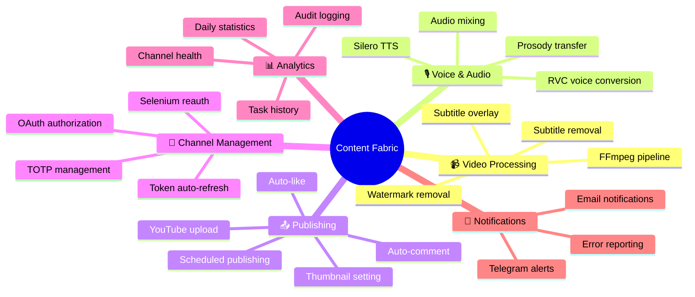

---

## 2. Product Vision & Business Model

### 2.1 Бизнес-модель

> [!IMPORTANT]
> Content Fabric — это внутренний инструмент для управления сетью YouTube-каналов. Основной бизнес — масштабное производство и дистрибуция видеоконтента по десяткам каналов одновременно.

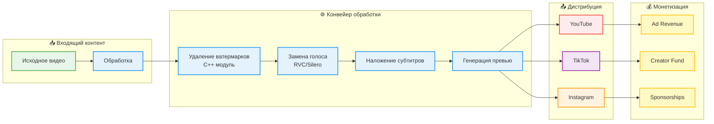

### 2.2 Целевая аудитория

| Роль | Описание | Как использует CFF |
|:-----|:---------|:-------------------|
| **Владелец сети каналов** | Управляет стратегией контента и монетизацией | Web portal: дашборд, статистика, планирование |
| **Контент-менеджер** | Подготавливает видео к публикации | Web portal: создание задач, загрузка файлов |
| **Технический специалист** | Настраивает каналы и автоматизацию | CLI: reauth, API: интеграции |
| **Разработчик** | Расширяет функциональность | REST API, код, тесты |

### 2.3 Жизненный цикл контента

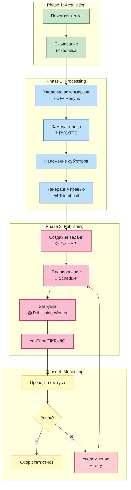

### 2.4 Ключевые бизнес-процессы

#### Процесс 1: Массовая публикация

```
📋 Пользователь создаёт 50 задач через batch API
       ↓
📅 Scheduler распределяет по расписанию (template slots)
       ↓
🔄 Worker загружает видео по 1 штуке (resumable upload)
       ↓
📊 Каждое видео: upload → thumbnail → like → comment
       ↓
✅ 3513 успешных / 2239 ошибок = 61% success rate
```

#### Процесс 2: Управление каналами

```
🔐 39 YouTube каналов с OAuth токенами
       ↓
⏰ Токены истекают каждые ~60 минут
       ↓
🔄 token_refresh.py автоматически обновляет через refresh_token
       ↓
❌ Если refresh_token невалиден → нужна полная реавторизация
       ↓
🌐 Web OAuth / CLI Selenium / SSH Tunnel
```

#### Процесс 3: Шаблоны расписания

```
📅 Шаблон "Daily Upload" = 3 слота/день × 7 дней = 21 слот/неделю
       ↓
🔗 Каждый слот привязан к каналу + время + медиа тип
       ↓
⚙️ Scheduler подбирает PENDING задачи по времени слотов
       ↓
📤 Автоматическая публикация без участия человека
```

---

## 3. System Overview

### 3.1 Архитектура верхнего уровня

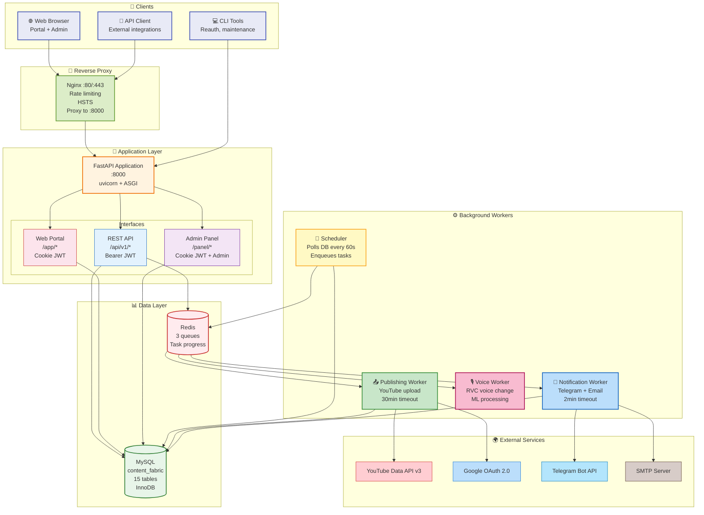

### 3.2 Потоки данных

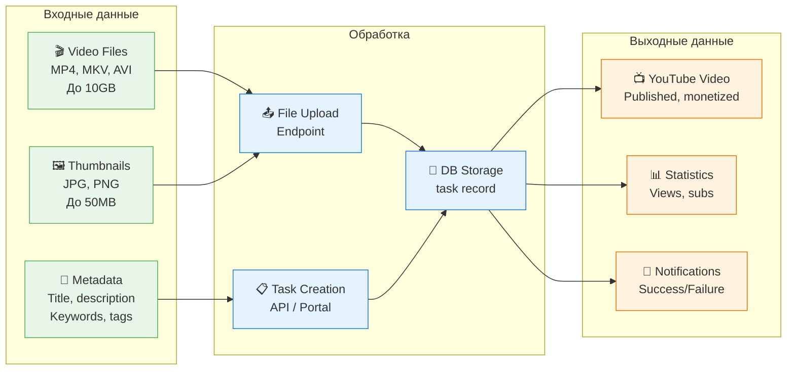

---

## 4. Infrastructure

### 4.1 Server Specification

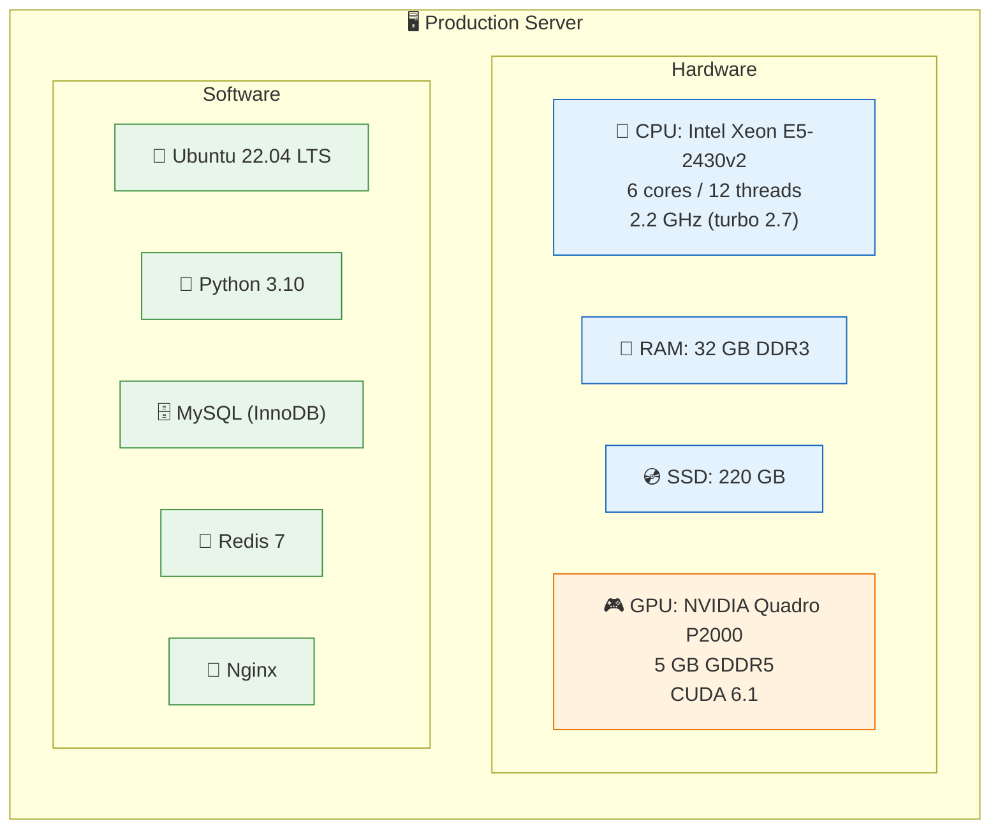

> [!NOTE]
> **Хостинг:** ZOMRO (zomro.com)
> **IP:** `46.21.250.43`
> **Панель управления:** FASTPANEL на порту `:8888`

### 4.2 Сетевая архитектура

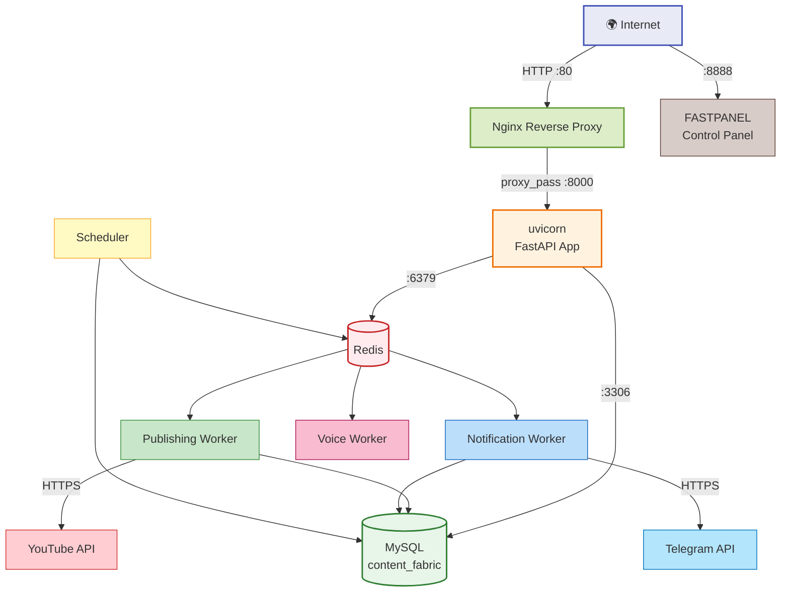

### 4.3 Порты и протоколы

| Порт | Сервис | Протокол | Доступ |
|:-----|:-------|:---------|:-------|
| `:80` | Nginx | HTTP | Public |
| `:443` | FASTPANEL (перехватывает!) | HTTPS | Public |
| `:8000` | uvicorn (FastAPI) | HTTP | localhost only |
| `:8888` | FASTPANEL | HTTPS | Public |
| `:3306` | MySQL | TCP | localhost only |
| `:6379` | Redis | TCP | localhost only |
| `:8080` | Reauth OAuth callback | HTTP | CLI only (temporary) |

> [!WARNING]
> **FASTPANEL перехватывает порт 443**, что блокирует кастомные SSL-сертификаты. Поэтому `HTTPS_ENABLED=false` и cookie `Secure` flag отключён.

### 4.4 Файловая система сервера

```
/opt/content-fabric/               ← Project root
├── .env                           ← Main env (MySQL, Redis, JWT, Telegram)
├── prod/
│   ├── .env/
│   │   ├── .env.db               ← MySQL credentials
│   │   └── .env.api              ← YouTube API keys
│   ├── venv/                     ← Python virtual environment
│   ├── data/
│   │   ├── uploads/              ← Video files (до 10GB каждый)
│   │   └── logs/
│   │       └── reauth_failures/  ← Selenium screenshots on failure
│   └── ...
├── _prod_backup/                  ← Legacy backup (не используется)
└── ...

/var/log/
├── cff-api.log                   ← API logs
├── cff-scheduler.log             ← Scheduler logs
├── cff-publishing-worker.log     ← Upload logs
├── cff-notification-worker.log   ← Notification logs
└── nginx/
    ├── access.log                ← HTTP access logs
    └── error.log                 ← Nginx errors
```

---

## 5. Service Architecture

### 5.1 Systemd Services

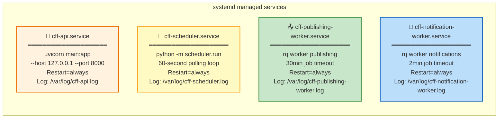

### 5.2 Взаимодействие сервисов

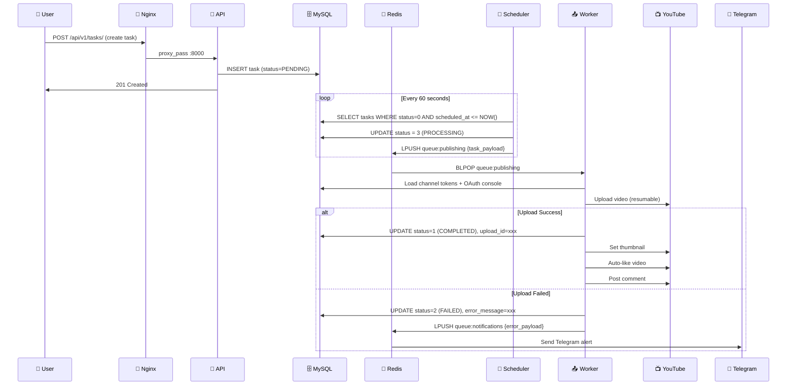

### 5.3 Компоненты FastAPI приложения

```mermaid
graph LR
    subgraph "main.py"
        APP[FastAPI App]
    end

    subgraph "Middleware"
        CORS[CORS]
        RATE[Rate Limiter\nslowapi]
        style CORS fill:#e8eaf6,stroke:#3f51b5
        style RATE fill:#e8eaf6,stroke:#3f51b5
    end

    APP --> CORS
    APP --> RATE

    subgraph "REST API /api/v1/"
        AUTH_E[/auth\nlogin, register, me]
        CHAN_E[/channels\nCRUD + tokens]
        TASK_E[/tasks\nCRUD + lifecycle]
        TMPL_E[/templates\nschedule templates]
        UP_E[/uploads\nfile upload]
        ADM_E[/admin\nadmin-only]
        style AUTH_E fill:#c8e6c9,stroke:#388e3c
        style CHAN_E fill:#c8e6c9,stroke:#388e3c
        style TASK_E fill:#c8e6c9,stroke:#388e3c
        style TMPL_E fill:#c8e6c9,stroke:#388e3c
        style UP_E fill:#c8e6c9,stroke:#388e3c
        style ADM_E fill:#c8e6c9,stroke:#388e3c
    end

    subgraph "Web Portal /app/"
        PORTAL_V[app_portal.py\n1400+ lines\n25+ routes]
        style PORTAL_V fill:#fce4ec,stroke:#c62828
    end

    subgraph "Admin Panel /panel/"
        PANEL_V[panel.py\nadmin-only views]
        style PANEL_V fill:#f3e5f5,stroke:#6a1b9a
    end

    APP --> AUTH_E
    APP --> CHAN_E
    APP --> TASK_E
    APP --> TMPL_E
    APP --> UP_E
    APP --> ADM_E
    APP --> PORTAL_V
    APP --> PANEL_V
```

---

## 6. Request Flow

### 6.1 API Request (Bearer JWT)

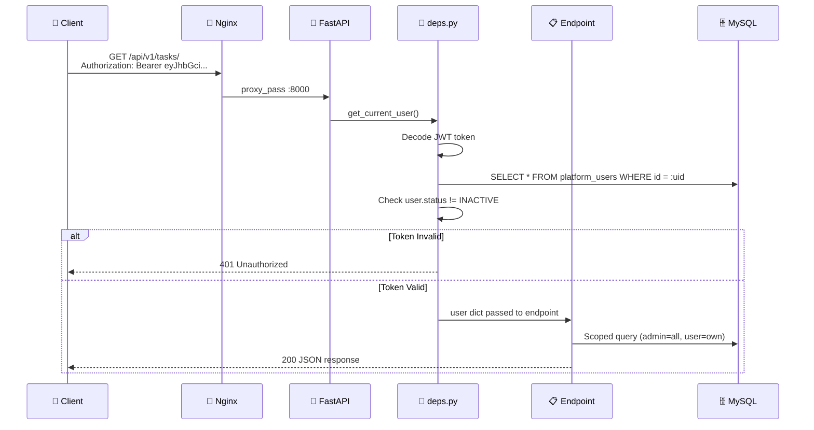

### 6.2 Portal Request (Cookie JWT)

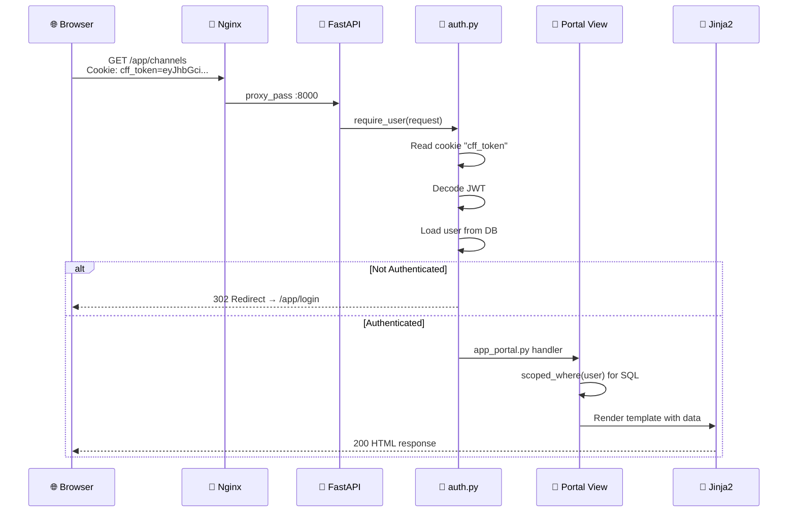

### 6.3 Authentication Flow

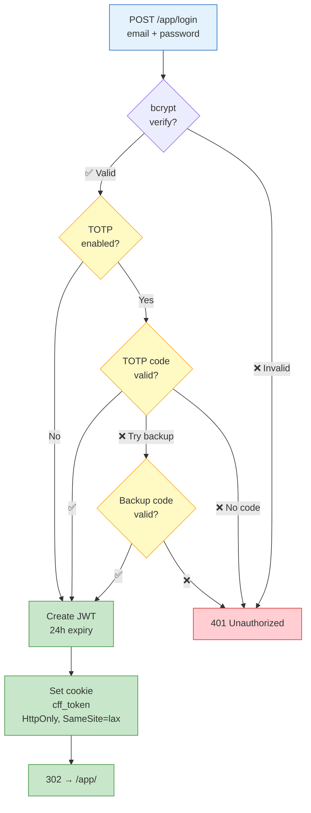

---

## 7. Task Lifecycle — Publishing Pipeline

### 7.1 Полный цикл задачи

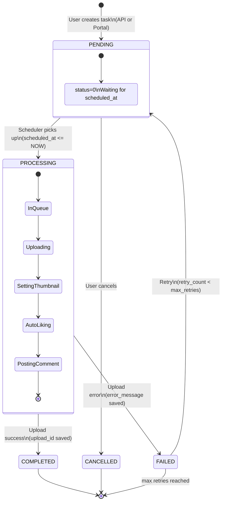

### 7.2 Статусы задач

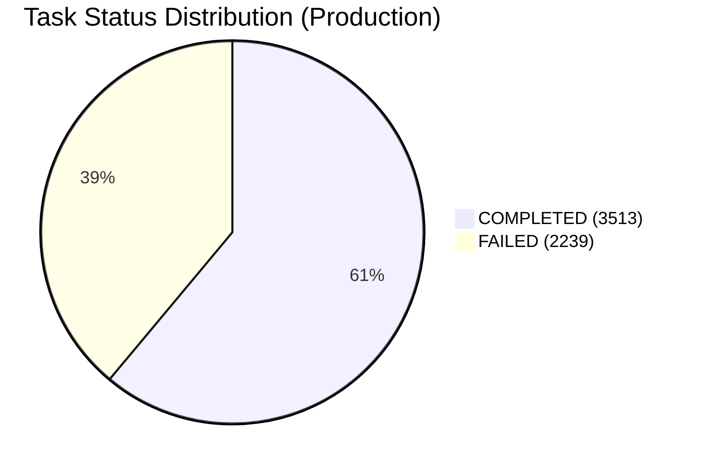

| Код | Название | Описание | Цвет |
|:---:|:---------|:---------|:-----|
| `0` | **PENDING** | Ожидает запланированного времени | 🟡 Yellow |
| `1` | **COMPLETED** | Успешно загружено на YouTube | 🟢 Green |
| `2` | **FAILED** | Ошибка загрузки (tokens expired, API limit, network) | 🔴 Red |
| `3` | **PROCESSING** | Scheduler подобрал, worker обрабатывает | 🔵 Blue |
| `4` | **CANCELLED** | Отменена пользователем | ⚪ Gray |

### 7.3 Scheduler — детальная логика

```mermaid
flowchart TD
    START[⏰ Scheduler Loop\nEvery 60 seconds] --> QUERY[SELECT tasks\nWHERE status = 0\nAND scheduled_at <= NOW\nORDER BY scheduled_at ASC]

    QUERY --> CHECK{Tasks\nfound?}

    CHECK -->|No| SLEEP[Sleep 60s]
    SLEEP --> START

    CHECK -->|Yes| LOOP[For each task]

    LOOP --> UPDATE[UPDATE status = 3\nPROCESSING]
    UPDATE --> LOAD[Load channel data\n+ OAuth console]
    LOAD --> ENQUEUE[LPUSH redis queue:publishing\n{task_id, channel_id, file_path, ...}]
    ENQUEUE --> LOG[Log: task enqueued]
    LOG --> NEXT{More\ntasks?}

    NEXT -->|Yes| LOOP
    NEXT -->|No| SLEEP

    style START fill:#fff9c4,stroke:#f9a825,stroke-width:2px
    style UPDATE fill:#bbdefb,stroke:#1565c0
    style ENQUEUE fill:#c8e6c9,stroke:#388e3c
    style SLEEP fill:#f5f5f5,stroke:#9e9e9e
```

### 7.4 Publishing Worker — YouTube Upload Pipeline

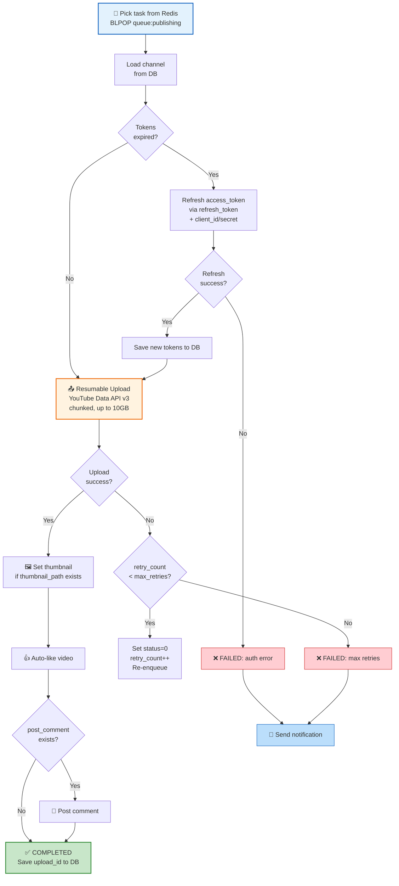

---

## 8. OAuth & Reauthorization Flow

### 8.1 Зачем нужна реавторизация

> [!IMPORTANT]
> YouTube OAuth access_token живёт **~60 минут**. Обычно используется refresh_token для автоматического обновления. Но refresh_token может стать невалидным:
> - Google отзывает токен (security policy)
> - Пользователь меняет пароль Google-аккаунта
> - Превышен лимит refresh_tokens (25 на аккаунт)
> - 6 месяцев без использования
>
> В этом случае нужна **полная реавторизация** через OAuth consent screen.

### 8.2 Три метода реавторизации

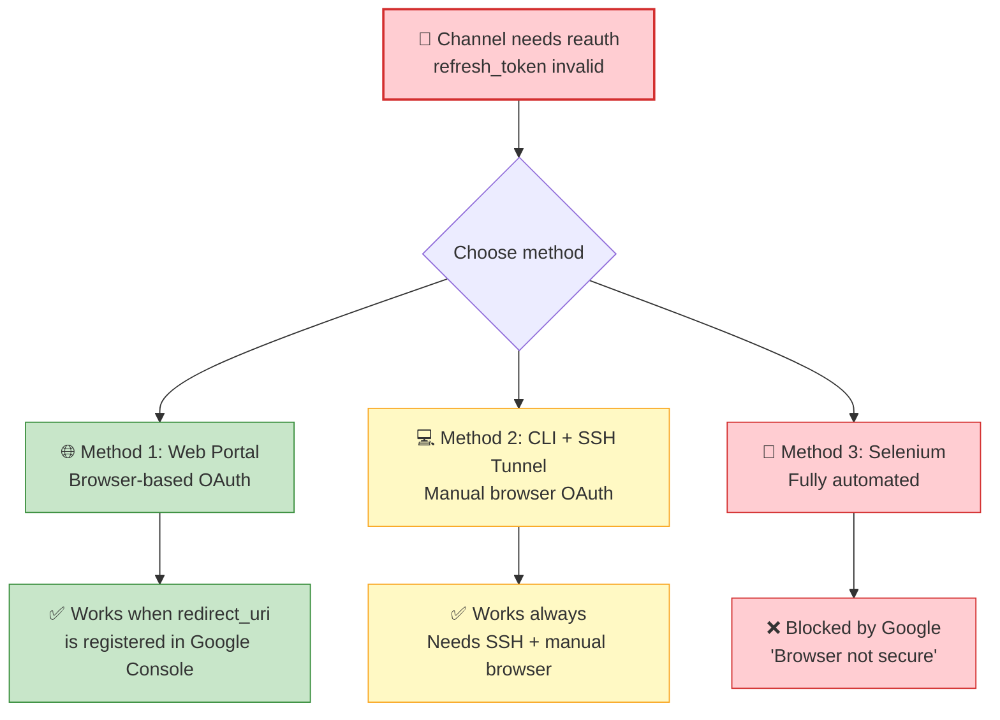

### 8.3 Web Portal OAuth Flow

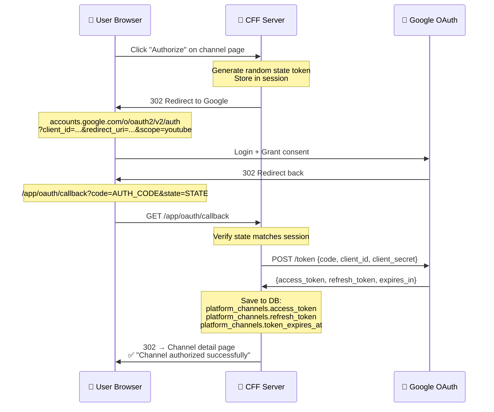

### 8.4 CLI + SSH Tunnel Flow

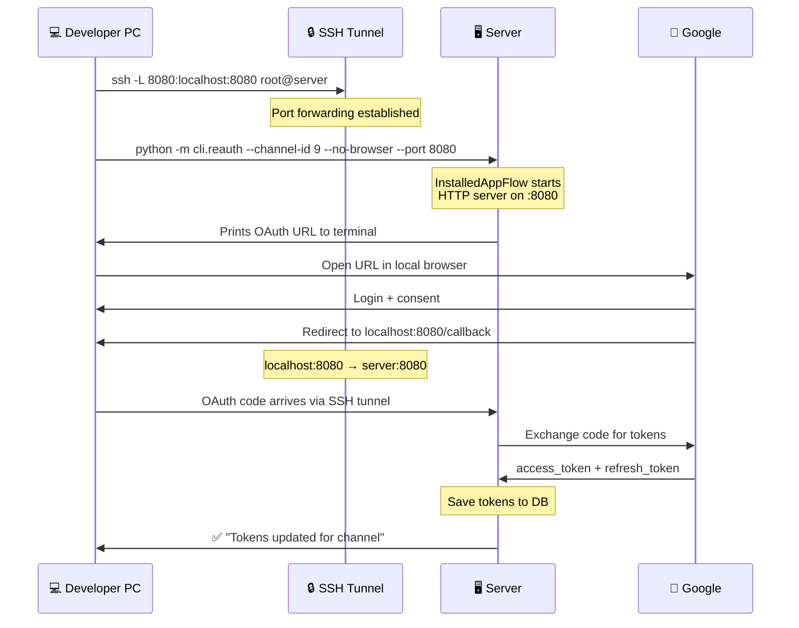

### 8.5 TOTP Management

```mermaid
flowchart LR
    subgraph "Web Portal /app/totp"
        VIEW[View channels\nwith TOTP status] --> EDIT[Enter TOTP secret\nfor a channel]
        EDIT --> SAVE[POST /app/totp\nSave to DB]
        SAVE --> VERIFY[Secret masked\nin UI: abc***xyz]
    end

    subgraph "Usage in Reauth"
        VERIFY --> REAUTH[Selenium reads\nTOTP secret from DB]
        REAUTH --> GENERATE[pyotp generates\n6-digit code]
        GENERATE --> GOOGLE[Submit to Google\nlogin form]
    end

    style VIEW fill:#e3f2fd,stroke:#1565c0
    style EDIT fill:#e3f2fd,stroke:#1565c0
    style SAVE fill:#c8e6c9,stroke:#388e3c
    style VERIFY fill:#c8e6c9,stroke:#388e3c
    style REAUTH fill:#fff3e0,stroke:#ef6c00
    style GENERATE fill:#fff3e0,stroke:#ef6c00
    style GOOGLE fill:#fff3e0,stroke:#ef6c00
```

---

## 9. Directory Structure

### 9.1 Полная структура проекта

```
content-fabric/                          ← Git repository root
│
├── 📁 prod/                             ← MAIN CODEBASE (~14,000 lines Python)
│   │
│   ├── 📄 main.py                       ← FastAPI app entry point, middleware setup
│   ├── 📄 requirements.txt              ← 24 Python dependencies
│   ├── 📄 Dockerfile                    ← Docker build (alternative to systemd)
│   ├── 📄 docker-compose.yml            ← Full stack: 6 containers
│   ├── 📄 .env.example                  ← Environment variables template
│   │
│   ├── 📁 app/                          ← Application layer
│   │   │
│   │   ├── 📁 api/                      ← REST API endpoints
│   │   │   ├── 📄 deps.py               ← get_current_user() — JWT auth dependency
│   │   │   ├── 📄 routes.py             ← Router includes: auth, channels, tasks, templates, uploads, admin
│   │   │   └── 📁 endpoints/
│   │   │       ├── 📄 auth.py            ← POST /login, /register, GET /me, POST /change-password
│   │   │       ├── 📄 channels.py        ← Channel CRUD (list, create, get, update, delete, stats)
│   │   │       ├── 📄 tasks.py           ← Task CRUD (create, batch, list, update, cancel, status, progress)
│   │   │       ├── 📄 templates.py       ← Schedule template CRUD (create, list, slots)
│   │   │       ├── 📄 uploads.py         ← File upload endpoint (10GB video, 50MB thumbnail)
│   │   │       └── 📄 admin.py           ← Admin-only: user management, system stats
│   │   │
│   │   ├── 📁 core/                     ← Core application logic
│   │   │   ├── 📄 config.py             ← Pydantic Settings (BASE_URL, JWT, DB, Redis, etc.)
│   │   │   ├── 📄 security.py           ← JWT encode/decode, password hashing (bcrypt)
│   │   │   ├── 📄 auth.py               ← require_user(), scoped_where(), check_owner_or_404()
│   │   │   ├── 📄 audit.py              ← Structured audit logging for critical operations
│   │   │   └── 📄 database.py           ← DB session helper
│   │   │
│   │   ├── 📁 schemas/                  ← Pydantic v2 request/response models
│   │   │   ├── 📄 auth.py               ← LoginRequest, RegisterRequest, TokenResponse, TOTPSetup
│   │   │   ├── 📄 channel.py            ← Channel, ChannelCreate, ChannelUpdate
│   │   │   ├── 📄 task.py               ← TaskCreate, TaskBatchCreate, TaskResponse, TaskUpdate
│   │   │   └── 📄 template.py           ← TemplateCreate, SlotCreate, TemplateResponse
│   │   │
│   │   ├── 📁 views/                    ← Server-side rendered pages (Jinja2)
│   │   │   ├── 📄 app_portal.py         ← User Portal — 1400+ lines, 25+ routes
│   │   │   └── 📄 panel.py              ← Admin Panel — users, channels, tasks, consoles, health
│   │   │
│   │   └── 📁 templates/               ← Jinja2 HTML templates (27 files, 2286 lines)
│   │       ├── 📄 app_base.html         ← Base layout: sidebar navigation, user info
│   │       ├── 📄 app_dashboard.html    ← Dashboard: stat cards, recent tasks, channel health
│   │       ├── 📄 app_channels.html     ← Channel list: name, YT ID, tokens, expiry
│   │       ├── 📄 app_channel_detail.html ← Channel detail: tokens, console, credentials
│   │       ├── 📄 app_channel_form.html  ← Channel create/edit form
│   │       ├── 📄 app_tasks.html         ← Task list with status filters and pagination
│   │       ├── 📄 app_task_detail.html   ← Task detail: metadata, status, actions
│   │       ├── 📄 app_task_form.html     ← Task creation with file upload
│   │       ├── 📄 app_templates.html     ← Schedule template list
│   │       ├── 📄 app_template_detail.html ← Template with slot management
│   │       ├── 📄 app_settings.html      ← User settings: profile, password, 2FA setup
│   │       ├── 📄 app_reauth.html        ← Batch reauthorization page
│   │       ├── 📄 app_totp.html          ← TOTP secret management for channels
│   │       ├── 📄 base.html              ← Admin panel base layout
│   │       ├── 📄 health.html            ← System health: services, DB, Redis, disk
│   │       └── 📄 logs.html              ← Log viewer (admin)
│   │
│   ├── 📁 shared/                       ← Shared between API, Workers, CLI
│   │   │
│   │   ├── 📄 env.py                    ← Dotenv loader (loads .env, .env.db, .env.api)
│   │   ├── 📄 logging_config.py         ← JSON/plain configurable logging
│   │   │
│   │   ├── 📁 db/                       ← Database layer
│   │   │   ├── 📄 connection.py         ← SQLAlchemy engine, connection pool, get_connection()
│   │   │   ├── 📄 models.py             ← 15 table definitions (SQLAlchemy Core) + IntEnums
│   │   │   ├── 📄 utils.py              ← serialize_json(), deserialize_json(), build_update(), truncate_error()
│   │   │   └── 📁 repositories/         ← Data Access Layer (8 repositories)
│   │   │       ├── 📄 __init__.py        ← Convenience re-exports
│   │   │       ├── 📄 user_repo.py       ← User CRUD, 2FA setup, backup codes, password reset
│   │   │       ├── 📄 channel_repo.py    ← Channel CRUD, token update, stats aggregation
│   │   │       ├── 📄 task_repo.py       ← Task lifecycle: create, batch, status transitions
│   │   │       ├── 📄 template_repo.py   ← Schedule templates + time slots
│   │   │       ├── 📄 credential_repo.py ← RPA login credentials (email, password, proxy)
│   │   │       ├── 📄 console_repo.py    ← OAuth console management (client_id/secret)
│   │   │       ├── 📄 stats_repo.py      ← Channel daily statistics (subscribers, views)
│   │   │       └── 📄 audit_repo.py      ← Reauth audit log (initiated, completed, errors)
│   │   │
│   │   ├── 📁 queue/                    ← Redis queue layer
│   │   │   ├── 📄 config.py             ← Redis connection, queue names
│   │   │   ├── 📄 publisher.py          ← enqueue_video_upload(), enqueue_notification()
│   │   │   └── 📄 types.py              ← Payload dataclasses (VideoUploadPayload, etc.)
│   │   │
│   │   ├── 📁 youtube/                  ← YouTube integration
│   │   │   ├── 📄 client.py             ← upload_video(), set_thumbnail(), like_video()
│   │   │   ├── 📄 upload.py             ← process_upload() — full upload pipeline
│   │   │   ├── 📄 token_refresh.py      ← OAuth token auto-refresh via refresh_token
│   │   │   └── 📁 reauth/              ← Automated reauthorization module
│   │   │       ├── 📄 __init__.py
│   │   │       ├── 📄 selenium_auth.py  ← Selenium + undetected-chromedriver login
│   │   │       ├── 📄 service.py        ← Orchestration: DB → OAuth → tokens → audit
│   │   │       └── 📄 models.py         ← ReauthResult, ReauthStatus dataclasses
│   │   │
│   │   ├── 📁 notifications/           ← Notification system
│   │   │   ├── 📄 telegram.py           ← send() → Telegram Bot API
│   │   │   ├── 📄 email.py             ← SMTP email sender
│   │   │   └── 📄 manager.py           ← Routing: which notification goes where
│   │   │
│   │   └── 📁 voice/                   ← Voice conversion (ML pipeline)
│   │       ├── 📄 changer.py            ← process_voice_change() — worker interface
│   │       ├── 📄 voice_changer.py      ← VoiceChanger class (RVC-based)
│   │       ├── 📄 mixer.py             ← Audio background mixing
│   │       ├── 📄 silero.py            ← Silero TTS (text-to-speech)
│   │       ├── 📄 prosody.py           ← Prosody transfer between voices
│   │       ├── 📄 stress.py            ← Word stress analysis
│   │       ├── 📄 stress_dictionaries.py ← Stress dictionary data
│   │       ├── 📄 parallel.py          ← Parallel audio processing
│   │       └── 📁 rvc/                 ← Retrieval-based Voice Conversion
│   │           ├── 📄 __init__.py
│   │           ├── 📄 inference.py      ← RVC model inference
│   │           ├── 📄 model_manager.py  ← RVC model loading/caching
│   │           └── 📄 sovits.py        ← So-VITS-SVC integration
│   │
│   ├── 📁 cli/                         ← Command-line tools
│   │   ├── 📄 __init__.py
│   │   └── 📄 reauth.py               ← YouTube re-auth CLI tool
│   │                                      python -m cli.reauth --channel-id N
│   │                                      python -m cli.reauth --all-failed
│   │
│   ├── 📁 scheduler/                   ← Task scheduler daemon
│   │   ├── 📄 run.py                   ← Entry point: infinite 60s polling loop
│   │   └── 📄 jobs.py                  ← enqueue_pending_tasks() — core logic
│   │
│   ├── 📁 workers/                     ← Background workers (rq)
│   │   ├── 📄 publishing_worker.py     ← YouTube upload worker (30min timeout)
│   │   ├── 📄 notification_worker.py   ← Telegram/Email worker (2min timeout)
│   │   └── 📄 voice_worker.py          ← Voice change worker (ML processing)
│   │
│   └── 📁 tests/                       ← Test suite (204 tests, 18 files)
│       ├── 📄 conftest.py              ← Pytest fixtures, mocked DB connections
│       ├── 📄 test_api_auth.py         ← Auth endpoints tests
│       ├── 📄 test_api_channels.py     ← Channel endpoints tests
│       ├── 📄 test_api_tasks.py        ← Task endpoints tests
│       ├── 📄 test_api_templates.py    ← Template endpoints tests
│       ├── 📄 test_api_admin.py        ← Admin endpoints tests
│       ├── 📄 test_api_uploads.py      ← File upload tests
│       ├── 📄 test_portal.py           ← Web portal tests
│       ├── 📄 test_panel.py            ← Admin panel tests
│       ├── 📄 test_task_repo.py        ← Task repository tests
│       ├── 📄 test_channel_repo.py     ← Channel repository tests
│       ├── 📄 test_security.py         ← Security tests (JWT, hashing)
│       ├── 📄 test_scheduler.py        ← Scheduler tests
│       ├── 📄 test_youtube_upload.py   ← YouTube upload pipeline tests
│       └── 📄 ...
│
├── 📁 database/                        ← Database migrations and DDL
│   └── 📁 DDL/
│       ├── 📁 migrations/              ← SQL migration scripts (001-010)
│       └── 📄 SCHEMA_INDEX.md          ← Schema documentation
│
├── 📁 deploy/                          ← Deployment configuration
│   ├── 📁 systemd/                     ← Service unit files (5 services)
│   │   ├── 📄 cff-api.service
│   │   ├── 📄 cff-scheduler.service
│   │   ├── 📄 cff-publishing-worker.service
│   │   ├── 📄 cff-notification-worker.service
│   │   └── 📄 cff-voice-worker.service
│   ├── 📁 nginx/                       ← Nginx configuration
│   │   └── 📄 content-fabric.conf
│   ├── 📄 logrotate-cff               ← Log rotation config
│   └── 📄 install-services.sh         ← Automated deployment script
│
├── 📁 cpp/video/                       ← C++ module (@graf_crayt)
│   ├── 📁 src/                         ← Watermark/subtitle removal
│   ├── 📁 include/                     ← Headers
│   ├── 📁 adapters/                    ← Python ↔ C++ bridge (scaffold)
│   └── 📄 CMakeLists.txt              ← Build configuration
│
├── 📁 docs/                            ← Documentation
│   ├── 📄 ARCHITECTURE.md             ← THIS FILE
│   └── 📄 REPORT_PMA.md              ← Project management audit report
│
└── 📁 .cursor/                         ← IDE configuration
    ├── 📁 docs/
    │   └── 📄 PROD_README.md          ← Developer guide
    └── 📁 rules/                       ← Cursor AI rules
```

---

## 10. Database Schema

### 10.1 Entity Relationship Diagram

```mermaid
erDiagram
    platform_users {
        int id PK
        varchar uuid UK
        varchar username UK
        varchar email UK
        varchar password_hash
        varchar auth_key
        varchar totp_secret
        tinyint totp_enabled
        json totp_backup_codes
        varchar display_name
        smallint status "0=inactive, 1=admin, 10=active"
        timestamp last_login_at
        timestamp created_at
        timestamp updated_at
    }

    platform_projects {
        int id PK
        varchar uuid UK
        int owner_id FK
        varchar name
        varchar slug UK
        text description
        varchar subscription_plan "starter/pro/enterprise"
        json settings
        smallint status
        timestamp created_at
    }

    platform_project_members {
        int id PK
        int project_id FK
        int user_id FK
        varchar role "viewer/editor/admin"
        int invited_by FK
        varchar status "active/pending/removed"
    }

    platform_oauth_credentials {
        int id PK
        int project_id FK
        varchar platform "google"
        varchar name
        text client_id
        text client_secret
        json redirect_uris
        tinyint enabled
    }

    platform_channels {
        int id PK
        varchar uuid UK
        int project_id FK
        int console_id FK "→oauth_credentials"
        int created_by FK
        varchar platform "youtube"
        varchar name
        varchar platform_channel_id
        text access_token
        text refresh_token
        datetime token_expires_at
        tinyint enabled
        tinyint processing_status
        json metadata
    }

    platform_channel_tokens {
        int id PK
        int channel_id FK
        varchar token_type
        text token_value
        datetime expires_at
    }

    platform_channel_login_credentials {
        int id PK
        int channel_id FK
        varchar login_email
        text login_password
        varchar totp_secret
        json backup_codes
        varchar proxy_host
        int proxy_port
        varchar proxy_username
        varchar proxy_password
        varchar profile_path
        varchar user_agent
        datetime last_success_at
        datetime last_attempt_at
        text last_error
        tinyint enabled
    }

    content_upload_queue_tasks {
        int id PK
        varchar uuid UK
        int project_id FK
        int channel_id FK
        int created_by FK
        varchar platform "youtube"
        varchar media_type "video/short"
        tinyint status "0-4"
        varchar source_file_path
        varchar thumbnail_path
        varchar title
        text description
        text keywords
        text post_comment
        json metadata
        datetime scheduled_at
        datetime completed_at
        varchar upload_id
        int retry_count
        int max_retries
        text error_message
    }

    channel_daily_statistics {
        int id PK
        int channel_id FK
        varchar platform_channel_id
        datetime snapshot_date
        bigint subscribers
        bigint views
        bigint videos
        bigint likes
        bigint comments
        json metadata
    }

    channel_reauth_audit_logs {
        bigint id PK
        int channel_id FK
        datetime initiated_at
        datetime completed_at
        varchar status "started/success/failed"
        varchar trigger_reason
        text error_message
        varchar error_code
        json metadata
    }

    schedule_templates {
        int id PK
        varchar uuid UK
        int project_id FK
        int created_by FK
        varchar name
        varchar timezone "UTC"
        tinyint is_active
    }

    schedule_template_slots {
        int id PK
        int template_id FK
        tinyint day_of_week "0-6"
        varchar time_utc "HH:MM"
        int channel_id FK
        varchar media_type
        tinyint enabled
    }

    live_streaming_accounts {
        int id PK
        int project_id FK
        varchar platform "youtube/twitch"
        varchar name
        text access_token
        text refresh_token
    }

    live_stream_configurations {
        int id PK
        int project_id FK
        int streaming_account_id FK
        int channel_id FK
        varchar name
        varchar rtmp_host
        varchar stream_key
        int duration_sec
    }

    platform_schema_migrations {
        int id PK
        varchar version UK
        varchar description
        varchar checksum
        timestamp applied_at
        int execution_ms
        tinyint rolled_back
    }

    platform_users ||--o{ platform_projects : "owns"
    platform_projects ||--o{ platform_project_members : "has members"
    platform_users ||--o{ platform_project_members : "member of"
    platform_projects ||--o{ platform_oauth_credentials : "has consoles"
    platform_projects ||--o{ platform_channels : "has channels"
    platform_oauth_credentials ||--o{ platform_channels : "used by"
    platform_users ||--o{ platform_channels : "created"
    platform_channels ||--o{ platform_channel_tokens : "has tokens"
    platform_channels ||--o{ platform_channel_login_credentials : "has login creds"
    platform_channels ||--o{ content_upload_queue_tasks : "has tasks"
    platform_channels ||--o{ channel_daily_statistics : "has stats"
    platform_channels ||--o{ channel_reauth_audit_logs : "has audit"
    platform_projects ||--o{ schedule_templates : "has templates"
    schedule_templates ||--o{ schedule_template_slots : "has slots"
    platform_channels ||--o{ schedule_template_slots : "assigned to"
    platform_projects ||--o{ live_streaming_accounts : "has accounts"
    live_streaming_accounts ||--o{ live_stream_configurations : "has configs"
```

### 10.2 Table Statistics (Production)

| Таблица | Записей | Описание | Частота записи |
|:--------|--------:|:---------|:---------------|
| `platform_users` | 10 | Пользователи системы | Редко |
| `platform_projects` | ~3 | Проекты (группировка каналов) | Редко |
| `platform_project_members` | ~15 | Участники проектов | Редко |
| `platform_oauth_credentials` | 7 | Google Cloud Console проекты | Редко |
| `platform_channels` | 39 | YouTube каналы | Часто (token updates) |
| `platform_channel_tokens` | ~50 | Дополнительные токены | Часто |
| `platform_channel_login_credentials` | 36 | RPA логины (email, proxy) | Средне |
| `content_upload_queue_tasks` | 5,752 | Задачи на публикацию | **Очень часто** |
| `channel_daily_statistics` | ~1,400 | Ежедневная статистика | Ежедневно |
| `channel_reauth_audit_logs` | 3,836 | Лог реавторизаций | Часто |
| `schedule_templates` | 3 | Шаблоны расписания | Редко |
| `schedule_template_slots` | ~20 | Слоты в шаблонах | Редко |
| `live_streaming_accounts` | ~5 | Аккаунты стриминга | Редко |
| `live_stream_configurations` | ~10 | Конфигурации стримов | Средне |
| `platform_schema_migrations` | 10 | Миграции БД | Только deploy |

### 10.3 Ключевые особенности схемы

> [!TIP]
> **SQLAlchemy Core** (не ORM!) — все таблицы определены через `Table()` объекты в `models.py`.
>
> **IntEnum** для статусов — `TaskStatus` (0-4) и `UserStatus` (0, 1, 10). При SQL-запросах **обязательно** `.value`:
> ```python
> task_repo.get_all_tasks(status=TaskStatus.PENDING.value)  # ✅
> task_repo.get_all_tasks(status=TaskStatus.PENDING)         # ❌ breaks
> ```
>
> **Column key trick** — колонка `metadata` в БД конфликтует с SQLAlchemy `MetaData`:
> ```python
> Column("metadata", JSON, key="meta")  # DB column = "metadata", Python key = "meta"
> ```

---

## 11. API Reference

### 11.1 Authentication

| Method | Endpoint | Description | Auth |
|:-------|:---------|:------------|:-----|
| `POST` | `/api/v1/auth/login` | Login, get JWT | None |
| `POST` | `/api/v1/auth/register` | Register new user | None |
| `GET` | `/api/v1/auth/me` | Get current user | Bearer JWT |
| `POST` | `/api/v1/auth/change-password` | Change password | Bearer JWT |
| `POST` | `/api/v1/auth/totp/setup` | Enable 2FA | Bearer JWT |
| `POST` | `/api/v1/auth/totp/verify` | Verify 2FA code | Bearer JWT |
| `POST` | `/api/v1/auth/totp/disable` | Disable 2FA | Bearer JWT |

#### Login Request

```json
POST /api/v1/auth/login
Content-Type: application/json

{
    "email": "admin@example.com",
    "password": "securepassword",
    "totp_code": "123456"  // optional, only if 2FA enabled
}
```

#### Login Response

```json
{
    "access_token": "eyJhbGciOiJIUzI1NiIs...",
    "token_type": "bearer",
    "user": {
        "id": 1,
        "uuid": "550e8400-e29b-41d4-a716-446655440000",
        "username": "admin",
        "email": "admin@example.com",
        "display_name": "Admin",
        "status": 1
    }
}
```

### 11.2 Channels

| Method | Endpoint | Description | Auth | Rate Limit |
|:-------|:---------|:------------|:-----|:-----------|
| `GET` | `/api/v1/channels/` | List channels | Bearer JWT | — |
| `POST` | `/api/v1/channels/` | Create channel | Bearer JWT | 10/min |
| `GET` | `/api/v1/channels/{uuid}` | Get channel detail | Bearer JWT | — |
| `PUT` | `/api/v1/channels/{uuid}` | Update channel | Bearer JWT | — |
| `DELETE` | `/api/v1/channels/{uuid}` | Delete channel | Bearer JWT | — |
| `GET` | `/api/v1/channels/{uuid}/stats` | Channel statistics | Bearer JWT | — |

#### Create Channel Request

```json
POST /api/v1/channels/
Authorization: Bearer eyJhbG...

{
    "name": "My Channel",
    "platform_channel_id": "UC1234567890",
    "platform": "youtube",
    "console_id": 3
}
```

### 11.3 Tasks

| Method | Endpoint | Description | Auth | Rate Limit |
|:-------|:---------|:------------|:-----|:-----------|
| `POST` | `/api/v1/tasks/` | Create task | Bearer JWT | 20/min |
| `POST` | `/api/v1/tasks/batch` | Batch create (up to 100) | Bearer JWT | 5/min |
| `GET` | `/api/v1/tasks/` | List tasks | Bearer JWT | — |
| `GET` | `/api/v1/tasks/calendar` | Calendar view | Bearer JWT | — |
| `GET` | `/api/v1/tasks/history` | Completed/failed tasks | Bearer JWT | — |
| `GET` | `/api/v1/tasks/stats/summary` | Aggregate statistics | Bearer JWT | — |
| `GET` | `/api/v1/tasks/{id}` | Get task detail | Bearer JWT | — |
| `PUT` | `/api/v1/tasks/{id}` | Update task | Bearer JWT | — |
| `POST` | `/api/v1/tasks/{id}/cancel` | Cancel task | Bearer JWT | — |
| `GET` | `/api/v1/tasks/{id}/status` | Quick status check | Bearer JWT | — |
| `GET` | `/api/v1/tasks/{id}/progress` | Upload progress (from Redis) | Bearer JWT | — |
| `GET` | `/api/v1/tasks/{id}/preview` | File info preview | Bearer JWT | — |

#### Create Task Request

```json
POST /api/v1/tasks/
Authorization: Bearer eyJhbG...

{
    "channel_id": 9,
    "source_file_path": "uploads/video_001.mp4",
    "title": "Amazing Video Title",
    "scheduled_at": "2026-03-22T14:00:00",
    "media_type": "video",
    "thumbnail_path": "uploads/thumb_001.jpg",
    "description": "Video description for YouTube",
    "keywords": "keyword1, keyword2, keyword3",
    "post_comment": "First comment under the video!",
    "legacy_add_info": {"category": "22", "privacy": "public"}
}
```

#### Task Response

```json
{
    "id": 5753,
    "uuid": "a1b2c3d4-e5f6-7890-abcd-ef1234567890",
    "channel_id": 9,
    "media_type": "video",
    "status": 0,
    "source_file_path": "uploads/video_001.mp4",
    "thumbnail_path": "uploads/thumb_001.jpg",
    "title": "Amazing Video Title",
    "description": "Video description for YouTube",
    "keywords": "keyword1, keyword2, keyword3",
    "post_comment": "First comment under the video!",
    "scheduled_at": "2026-03-22T14:00:00",
    "completed_at": null,
    "upload_id": null,
    "error_message": null,
    "retry_count": 0,
    "created_at": "2026-03-21T10:30:00"
}
```

#### Batch Create

```json
POST /api/v1/tasks/batch
Authorization: Bearer eyJhbG...

{
    "tasks": [
        {
            "channel_id": 9,
            "source_file_path": "uploads/vid1.mp4",
            "title": "Video 1",
            "scheduled_at": "2026-03-22T10:00:00"
        },
        {
            "channel_id": 12,
            "source_file_path": "uploads/vid2.mp4",
            "title": "Video 2",
            "scheduled_at": "2026-03-22T12:00:00"
        }
    ]
}
```

### 11.4 Schedule Templates

| Method | Endpoint | Description | Auth |
|:-------|:---------|:------------|:-----|
| `POST` | `/api/v1/templates/` | Create template | Bearer JWT |
| `GET` | `/api/v1/templates/` | List templates | Bearer JWT |
| `GET` | `/api/v1/templates/{uuid}` | Get template detail | Bearer JWT |
| `PUT` | `/api/v1/templates/{uuid}` | Update template | Bearer JWT |
| `DELETE` | `/api/v1/templates/{uuid}` | Delete template | Bearer JWT |
| `POST` | `/api/v1/templates/{uuid}/slots` | Add time slot | Bearer JWT |
| `DELETE` | `/api/v1/templates/{uuid}/slots/{slot_id}` | Remove slot | Bearer JWT |

### 11.5 File Uploads

| Method | Endpoint | Description | Auth | Limits |
|:-------|:---------|:------------|:-----|:-------|
| `POST` | `/api/v1/uploads/video` | Upload video file | Bearer JWT | 10 GB |
| `POST` | `/api/v1/uploads/thumbnail` | Upload thumbnail | Bearer JWT | 50 MB |

### 11.6 Admin

| Method | Endpoint | Description | Auth |
|:-------|:---------|:------------|:-----|
| `GET` | `/api/v1/admin/users` | List all users | Admin JWT |
| `PUT` | `/api/v1/admin/users/{id}` | Update user | Admin JWT |
| `GET` | `/api/v1/admin/stats` | System statistics | Admin JWT |

---

## 12. Web Portal

### 12.1 Page Map

```mermaid
graph TD
    subgraph "🔐 Public"
        LOGIN["/app/login\nEmail + Password + TOTP"]
        REGISTER["/app/register\nNew user registration"]
        style LOGIN fill:#ffcdd2,stroke:#d32f2f
        style REGISTER fill:#ffcdd2,stroke:#d32f2f
    end

    subgraph "📊 Dashboard"
        DASH["/app/\nStat cards + recent tasks\n+ channel health"]
        style DASH fill:#c8e6c9,stroke:#388e3c
    end

    subgraph "📺 Channels"
        CH_LIST["/app/channels\nAll channels with\ntoken status"]
        CH_ADD["/app/channels/add\nCreate new channel"]
        CH_DETAIL["/app/channels/{uuid}\nDetail + credentials"]
        CH_EDIT["/app/channels/{uuid}/edit\nEdit channel"]
        CH_AUTH["/app/channels/{uuid}/authorize\nStart OAuth flow"]
        OAUTH_CB["/app/oauth/callback\nGoogle returns here"]
        style CH_LIST fill:#bbdefb,stroke:#1565c0
        style CH_ADD fill:#bbdefb,stroke:#1565c0
        style CH_DETAIL fill:#bbdefb,stroke:#1565c0
        style CH_EDIT fill:#bbdefb,stroke:#1565c0
        style CH_AUTH fill:#e8f5e9,stroke:#388e3c
        style OAUTH_CB fill:#e8f5e9,stroke:#388e3c
    end

    subgraph "📋 Tasks"
        T_LIST["/app/tasks\nTask list with filters"]
        T_NEW["/app/tasks/new\nCreate + upload files"]
        T_DETAIL["/app/tasks/{uuid}\nDetail + actions"]
        style T_LIST fill:#fff3e0,stroke:#ef6c00
        style T_NEW fill:#fff3e0,stroke:#ef6c00
        style T_DETAIL fill:#fff3e0,stroke:#ef6c00
    end

    subgraph "📅 Templates"
        TPL_LIST["/app/templates\nSchedule templates"]
        TPL_CREATE["/app/templates/create"]
        TPL_DETAIL["/app/templates/{uuid}\nSlot management"]
        style TPL_LIST fill:#f3e5f5,stroke:#6a1b9a
        style TPL_CREATE fill:#f3e5f5,stroke:#6a1b9a
        style TPL_DETAIL fill:#f3e5f5,stroke:#6a1b9a
    end

    subgraph "🔧 Settings"
        SETTINGS["/app/settings\nProfile + Password + 2FA"]
        REAUTH_P["/app/reauth\nBatch reauthorization"]
        TOTP_P["/app/totp\nTOTP secret management"]
        style SETTINGS fill:#fff9c4,stroke:#f9a825
        style REAUTH_P fill:#fff9c4,stroke:#f9a825
        style TOTP_P fill:#fff9c4,stroke:#f9a825
    end

    subgraph "🔒 Admin Only"
        ADMIN_PANEL["/panel/\nFull admin dashboard"]
        HEALTH["/health\nSystem health check"]
        style ADMIN_PANEL fill:#d7ccc8,stroke:#5d4037
        style HEALTH fill:#d7ccc8,stroke:#5d4037
    end

    LOGIN --> DASH
    DASH --> CH_LIST
    DASH --> T_LIST
    CH_LIST --> CH_DETAIL
    CH_DETAIL --> CH_AUTH
    CH_AUTH --> OAUTH_CB
    CH_LIST --> CH_ADD
    T_LIST --> T_NEW
    T_LIST --> T_DETAIL
```

### 12.2 Sidebar Navigation

```
┌────────────────────┐
│   Content Fabric   │
├────────────────────┤
│ 🏠 Dashboard       │ ← /app/
│ 📺 Channels        │ ← /app/channels
│ 📋 Tasks           │ ← /app/tasks
│ 📅 Templates       │ ← /app/templates
│ ⚙️ Settings        │ ← /app/settings
│ 🔒 Auth            │ ← /app/reauth
│ 🔐 TOTP            │ ← /app/totp
├────────────────────┤
│ 🔐 Admin Panel     │ ← /panel/ (admin only)
│ 💚 Health          │ ← /health (admin only)
├────────────────────┤
│ 👤 Admin           │
│ admin@cff.local    │
│ [Logout]           │
└────────────────────┘
```

### 12.3 Dashboard — что показывает

```mermaid
graph TB
    subgraph "📊 Dashboard Cards"
        direction LR
        C1["🟢 Total Channels\n39"]
        C2["🟡 Pending Tasks\n12"]
        C3["🟢 Completed\n3513"]
        C4["🔴 Failed\n2239"]
        style C1 fill:#c8e6c9,stroke:#388e3c
        style C2 fill:#fff9c4,stroke:#f9a825
        style C3 fill:#c8e6c9,stroke:#388e3c
        style C4 fill:#ffcdd2,stroke:#d32f2f
    end

    subgraph "📋 Recent Tasks Table"
        T1["ID | Channel | Title | Status | Scheduled"]
        style T1 fill:#e3f2fd,stroke:#1565c0
    end

    subgraph "📺 Channel Health"
        CH1["Channel | Token Status | Expires | Last Upload"]
        style CH1 fill:#fff3e0,stroke:#ef6c00
    end
```

---

## 13. Security Architecture

### 13.1 Defense in Depth

```mermaid
graph TB
    subgraph "Layer 1: Network"
        L1A[Nginx HSTS]
        L1B[server_tokens off]
        L1C[Rate limiting\n120 req/min global\n10 req/min auth]
        style L1A fill:#e8f5e9,stroke:#388e3c
        style L1B fill:#e8f5e9,stroke:#388e3c
        style L1C fill:#e8f5e9,stroke:#388e3c
    end

    subgraph "Layer 2: Authentication"
        L2A[Bearer JWT\nfor API]
        L2B[Cookie JWT\nHttpOnly, SameSite=lax\nfor Portal]
        L2C[2FA TOTP\n+ backup codes]
        style L2A fill:#bbdefb,stroke:#1565c0
        style L2B fill:#bbdefb,stroke:#1565c0
        style L2C fill:#bbdefb,stroke:#1565c0
    end

    subgraph "Layer 3: Authorization"
        L3A[User scoping\ncreated_by = :uid]
        L3B[Admin bypass\nstatus = 1]
        L3C[UUID in URLs\nno IDOR via int IDs]
        L3D[check_owner_or_404\nfor mutations]
        style L3A fill:#fff3e0,stroke:#ef6c00
        style L3B fill:#fff3e0,stroke:#ef6c00
        style L3C fill:#fff3e0,stroke:#ef6c00
        style L3D fill:#fff3e0,stroke:#ef6c00
    end

    subgraph "Layer 4: Input Validation"
        L4A[Pydantic v2\nschema validation]
        L4B[Path traversal\nreject .. and /]
        L4C[File size limits\n10GB video, 50MB thumb]
        L4D[Jinja2 autoescaping\nXSS prevention]
        style L4A fill:#f3e5f5,stroke:#6a1b9a
        style L4B fill:#f3e5f5,stroke:#6a1b9a
        style L4C fill:#f3e5f5,stroke:#6a1b9a
        style L4D fill:#f3e5f5,stroke:#6a1b9a
    end

    subgraph "Layer 5: Production"
        L5A[Swagger UI\ndisabled in prod]
        L5B[Health endpoint\nadmin-only details]
        L5C[pip-audit\n0 vulnerabilities]
        L5D[PyJWT\nnot python-jose]
        style L5A fill:#ffcdd2,stroke:#d32f2f
        style L5B fill:#ffcdd2,stroke:#d32f2f
        style L5C fill:#ffcdd2,stroke:#d32f2f
        style L5D fill:#ffcdd2,stroke:#d32f2f
    end

    L1A --> L2A
    L1B --> L2B
    L1C --> L2C
    L2A --> L3A
    L2B --> L3B
    L2C --> L3C
    L3A --> L4A
    L3B --> L4B
    L3D --> L4C
    L3C --> L4D
    L4A --> L5A
    L4B --> L5B
    L4C --> L5C
    L4D --> L5D
```

### 13.2 JWT Token Structure

```json
{
    "sub": 1,                          // User ID
    "email": "admin@example.com",
    "status": 1,                       // UserStatus enum value
    "exp": 1742745600,                 // 24h from creation
    "iat": 1742659200                  // Issued at
}
```

**Алгоритм:** HS256
**Секрет:** `JWT_SECRET_KEY` из `.env`
**Время жизни:** 24 часа
**Библиотека:** PyJWT (не python-jose — без CVE)

### 13.3 Password Hashing

```
Алгоритм: bcrypt
Библиотека: passlib[bcrypt]
Rounds: 12 (default)
Формат: $2b$12$<salt><hash>
```

### 13.4 CORS Policy

```python
allow_origins=["*"]          # ⚠️ Open — для внутреннего инструмента
allow_methods=["*"]
allow_headers=["*"]
allow_credentials=True
```

> [!CAUTION]
> CORS открыт (`*`) так как это внутренний инструмент без публичного API. При необходимости можно ограничить до конкретных доменов.

---

## 14. Voice & ML Pipeline

### 14.1 Архитектура голосового модуля

```mermaid
graph LR
    subgraph "📥 Input"
        AUDIO_IN[🎵 Original Audio\nMP3/WAV/FLAC]
        style AUDIO_IN fill:#e8f5e9,stroke:#388e3c
    end

    subgraph "🎙️ Processing Pipeline"
        RVC[RVC Voice Conversion\nRetrieval-based\nNeural network]
        SILERO[Silero TTS\nText-to-speech\nRussian/English]
        PROSODY[Prosody Transfer\nRhythm + intonation\nmatching]
        MIXER[Audio Mixer\nBackground music\n+ voice blend]
        STRESS[Stress Analysis\nWord emphasis\ncorrection]

        style RVC fill:#e3f2fd,stroke:#1565c0,stroke-width:2px
        style SILERO fill:#e3f2fd,stroke:#1565c0
        style PROSODY fill:#e3f2fd,stroke:#1565c0
        style MIXER fill:#e3f2fd,stroke:#1565c0
        style STRESS fill:#e3f2fd,stroke:#1565c0
    end

    subgraph "📤 Output"
        AUDIO_OUT[🎵 Processed Audio\nNew voice + background]
        style AUDIO_OUT fill:#fff3e0,stroke:#ef6c00
    end

    AUDIO_IN --> RVC
    AUDIO_IN --> SILERO
    RVC --> PROSODY
    SILERO --> PROSODY
    PROSODY --> STRESS
    STRESS --> MIXER
    MIXER --> AUDIO_OUT
```

### 14.2 RVC (Retrieval-based Voice Conversion)

```mermaid
flowchart TD
    INPUT[🎤 Source voice] --> EXTRACT[Extract features\nF0 pitch, mel-spec]
    EXTRACT --> MODEL[RVC Model\nNeural network]
    MODEL --> SYNTH[Synthesize\ntarget voice]
    SYNTH --> POST[Post-processing\nDe-noise, normalize]
    POST --> OUTPUT[🔊 Converted voice]

    VOICE_MODEL[📦 Voice Model .pth\nTrained on target voice] --> MODEL

    style INPUT fill:#e8f5e9,stroke:#388e3c
    style MODEL fill:#e3f2fd,stroke:#1565c0,stroke-width:2px
    style OUTPUT fill:#fff3e0,stroke:#ef6c00
    style VOICE_MODEL fill:#f3e5f5,stroke:#6a1b9a
```

### 14.3 Worker Integration

```
Voice Worker (cff-voice-worker.service)
    │
    ├── Picks jobs from Redis queue "voice"
    ├── Calls shared.voice.changer.process_voice_change()
    ├── Uses GPU (Quadro P2000) for ML inference
    ├── Requires: torch, librosa, soundfile
    └── Saves processed audio to disk
```

> [!WARNING]
> **GPU зависимости** (torch, librosa) установлены на сервере но **не в requirements.txt** — они слишком тяжёлые. Устанавливаются вручную:
> ```bash
> pip install torch torchvision torchaudio --index-url https://download.pytorch.org/whl/cu118
> pip install librosa soundfile
> ```

---

## 15. C++ Video Processing Module

### 15.1 Архитектура

```mermaid
graph TB
    subgraph "📹 C++ Module (prod/cpp/video/)"
        direction TB
        SRC[src/\nWatermark detection\nSubtitle detection\nRemoval algorithms]
        INC[include/\nHeaders, interfaces]
        ADAPT[adapters/\nPython ↔ C++ bridge\npybind11 / ctypes]
        CMAKE[CMakeLists.txt\nBuild configuration]

        style SRC fill:#e3f2fd,stroke:#1565c0
        style INC fill:#e3f2fd,stroke:#1565c0
        style ADAPT fill:#fff3e0,stroke:#ef6c00
        style CMAKE fill:#f5f5f5,stroke:#9e9e9e
    end

    subgraph "Dependencies"
        FFMPEG[FFmpeg\nVideo I/O]
        OPENCV[OpenCV\nImage processing]
        style FFMPEG fill:#e8f5e9,stroke:#388e3c
        style OPENCV fill:#e8f5e9,stroke:#388e3c
    end

    SRC --> FFMPEG
    SRC --> OPENCV
```

> [!NOTE]
> **Статус:** Scaffold (заготовка). Разработчик: **@graf_crayt**.
>
> **Функции (планируемые):**
> - Обнаружение и удаление водяных знаков
> - Обнаружение и удаление вшитых субтитров
> - Наложение своих субтитров с кастомным стилем
> - Интеграция с FFmpeg для видео I/O

---

## 16. Notification System

### 16.1 Архитектура уведомлений

```mermaid
graph TD
    subgraph "📤 Sources (Events)"
        E1[Task Failed\n❌ Upload error]
        E2[Task Completed\n✅ Upload success]
        E3[Reauth Failed\n🔐 Token expired]
        E4[System Alert\n⚠️ Worker down]
        style E1 fill:#ffcdd2,stroke:#d32f2f
        style E2 fill:#c8e6c9,stroke:#388e3c
        style E3 fill:#fff9c4,stroke:#f9a825
        style E4 fill:#e8eaf6,stroke:#3f51b5
    end

    subgraph "📮 Queue"
        REDIS_Q[Redis queue\n"notifications"]
        style REDIS_Q fill:#ffebee,stroke:#c62828,stroke-width:2px
    end

    subgraph "⚙️ Worker"
        NOTIF_W[Notification Worker\nmanager.py routing]
        style NOTIF_W fill:#e3f2fd,stroke:#1565c0
    end

    subgraph "📬 Channels"
        TG_CH[🤖 Telegram Bot\nBot API\nChat messages]
        EMAIL_CH[📧 Email\nSMTP\nHTML templates]
        style TG_CH fill:#b3e5fc,stroke:#0277bd
        style EMAIL_CH fill:#d7ccc8,stroke:#5d4037
    end

    E1 --> REDIS_Q
    E2 --> REDIS_Q
    E3 --> REDIS_Q
    E4 --> REDIS_Q

    REDIS_Q --> NOTIF_W
    NOTIF_W --> TG_CH
    NOTIF_W --> EMAIL_CH
```

### 16.2 Telegram Message Format

```
❌ Помилка завантаження

📺 Канал: BazaAudioKnig
📋 Задача: #5752 "Amazing Video"
⏰ Час: 2026-03-21 14:32:00
❗ Помилка: Token expired — refresh failed

🔄 Повторних спроб: 2/3
```

### 16.3 Конфигурация

| Переменная | Описание |
|:-----------|:---------|
| `TELEGRAM_BOT_TOKEN` | Токен Telegram бота |
| `TELEGRAM_CHAT_ID` | ID чата для уведомлений |
| `SMTP_HOST` | SMTP сервер |
| `SMTP_PORT` | SMTP порт |
| `SMTP_USERNAME` | Email login |
| `SMTP_PASSWORD` | Email password |

---

## 17. Schedule Templates Engine

### 17.1 Концепция

```mermaid
graph TD
    subgraph "📅 Template: Daily Upload Schedule"
        T[Template\nName: 'Daily Upload'\nTimezone: Europe/Kyiv\nActive: Yes]

        subgraph "Slots"
            S1["Mon 10:00 → Channel A\nvideo"]
            S2["Mon 14:00 → Channel B\nvideo"]
            S3["Mon 18:00 → Channel C\nshort"]
            S4["Tue 10:00 → Channel A\nvideo"]
            S5["Tue 14:00 → Channel D\nvideo"]
            S6["..."]
        end

        style T fill:#f3e5f5,stroke:#6a1b9a,stroke-width:2px
        style S1 fill:#e3f2fd,stroke:#1565c0
        style S2 fill:#e3f2fd,stroke:#1565c0
        style S3 fill:#fff3e0,stroke:#ef6c00
        style S4 fill:#e3f2fd,stroke:#1565c0
        style S5 fill:#e3f2fd,stroke:#1565c0
    end
```

### 17.2 Slot Structure

| Поле | Тип | Описание |
|:-----|:----|:---------|
| `day_of_week` | 0-6 | 0=Monday, 6=Sunday |
| `time_utc` | string | "HH:MM" в UTC |
| `channel_id` | FK | Целевой канал |
| `media_type` | string | "video" или "short" |
| `enabled` | boolean | Активен ли слот |

### 17.3 Как это работает

```mermaid
sequenceDiagram
    participant U as 👤 User
    participant P as 📄 Portal
    participant DB as 🗄️ DB
    participant S as 📅 Scheduler

    U->>P: Create template "Daily Upload"
    P->>DB: INSERT schedule_templates

    U->>P: Add slot: Mon 10:00 → Channel A
    P->>DB: INSERT schedule_template_slots

    U->>P: Create tasks for the week
    Note over P: Uses template slots to set<br/>scheduled_at for each task
    P->>DB: INSERT tasks with scheduled_at

    S->>DB: Poll: WHERE scheduled_at <= NOW()
    S->>S: Enqueue matching tasks
```

---

## 18. Tech Stack

### 18.1 Technology Overview

```mermaid
graph TB
    subgraph "🐍 Backend"
        PY310["Python 3.10"]
        FAST["FastAPI 0.135.1\nASGI web framework"]
        PYDANTIC["Pydantic 2.11.3\nData validation"]
        UVICORN_T["uvicorn 0.34.2\nASGI server"]
        JINJA["Jinja2 3.1.6\nTemplate engine"]
        style PY310 fill:#3776AB,stroke:#3776AB,color:#fff
        style FAST fill:#009688,stroke:#009688,color:#fff
        style PYDANTIC fill:#e92063,stroke:#e92063,color:#fff
        style UVICORN_T fill:#2196f3,stroke:#2196f3,color:#fff
        style JINJA fill:#b71c1c,stroke:#b71c1c,color:#fff
    end

    subgraph "🗄️ Data"
        MYSQL_T["MySQL\nInnoDB engine\n15 tables"]
        SQLA["SQLAlchemy Core\nTable definitions\nNot ORM!"]
        REDIS_T["Redis 7\n3 task queues\nProgress cache"]
        RQ_T["rq (Redis Queue)\nBackground workers"]
        style MYSQL_T fill:#4479A1,stroke:#4479A1,color:#fff
        style SQLA fill:#d32f2f,stroke:#d32f2f,color:#fff
        style REDIS_T fill:#DC382D,stroke:#DC382D,color:#fff
        style RQ_T fill:#ff5722,stroke:#ff5722,color:#fff
    end

    subgraph "🔐 Security"
        PYJWT["PyJWT\nJWT tokens"]
        PASSLIB["passlib + bcrypt\nPassword hashing"]
        PYOTP["pyotp\nTOTP 2FA"]
        SLOWAPI["slowapi\nRate limiting"]
        style PYJWT fill:#ff9800,stroke:#ff9800,color:#fff
        style PASSLIB fill:#795548,stroke:#795548,color:#fff
        style PYOTP fill:#607d8b,stroke:#607d8b,color:#fff
        style SLOWAPI fill:#9c27b0,stroke:#9c27b0,color:#fff
    end

    subgraph "🌍 External APIs"
        YTAPI["YouTube Data API v3\nUpload, metadata"]
        GAUTH["Google OAuth 2.0\nToken management"]
        TGAPI["Telegram Bot API\nNotifications"]
        SMTP_T["SMTP\nEmail notifications"]
        style YTAPI fill:#f44336,stroke:#f44336,color:#fff
        style GAUTH fill:#4285f4,stroke:#4285f4,color:#fff
        style TGAPI fill:#0088cc,stroke:#0088cc,color:#fff
        style SMTP_T fill:#616161,stroke:#616161,color:#fff
    end

    subgraph "🤖 Automation"
        SELENIUM_T["Selenium\nBrowser automation"]
        UC["undetected-chromedriver\nAnti-detection"]
        style SELENIUM_T fill:#43b02a,stroke:#43b02a,color:#fff
        style UC fill:#2e7d32,stroke:#2e7d32,color:#fff
    end

    subgraph "🎙️ ML / Audio"
        TORCH["PyTorch\nNeural network inference"]
        LIBROSA["librosa\nAudio analysis"]
        RVC_T["RVC\nVoice conversion"]
        SILERO_T["Silero\nTTS engine"]
        style TORCH fill:#ee4c2c,stroke:#ee4c2c,color:#fff
        style LIBROSA fill:#1db954,stroke:#1db954,color:#fff
        style RVC_T fill:#673ab7,stroke:#673ab7,color:#fff
        style SILERO_T fill:#00bcd4,stroke:#00bcd4,color:#fff
    end

    subgraph "🚀 DevOps"
        SYSTEMD["systemd\n5 service units"]
        NGINX_T["Nginx\nReverse proxy"]
        DOCKER_T["Docker\nAlternative deploy"]
        LOGROTATE["logrotate\nLog management"]
        style SYSTEMD fill:#333,stroke:#333,color:#fff
        style NGINX_T fill:#009639,stroke:#009639,color:#fff
        style DOCKER_T fill:#2496ed,stroke:#2496ed,color:#fff
        style LOGROTATE fill:#757575,stroke:#757575,color:#fff
    end
```

### 18.2 Python Dependencies

```
# Core
fastapi==0.135.1                # Web framework
uvicorn==0.34.2                 # ASGI server
pydantic==2.11.3                # Validation
pydantic-settings==2.8.1        # Settings management
jinja2==3.1.6                   # HTML templates

# Database
sqlalchemy==2.0.40              # SQL toolkit (Core, not ORM)
pymysql==1.1.1                  # MySQL driver
cryptography==44.0.2            # For PyMySQL SSL

# Queue
redis==5.2.1                    # Redis client
rq==2.1.0                       # Redis Queue (workers)

# Auth
PyJWT==2.10.1                   # JWT tokens
passlib[bcrypt]==1.7.4          # Password hashing
pyotp==2.9.0                    # TOTP 2FA

# Security
slowapi==0.1.9                  # Rate limiting
python-multipart==0.0.20        # File uploads

# Automation
undetected-chromedriver>=3.5    # Anti-detection Selenium
selenium                        # Browser automation
google-auth-oauthlib            # Google OAuth helpers

# HTTP
httpx==0.28.1                   # Async HTTP client
requests==2.32.3                # Sync HTTP client

# Notifications
python-dotenv==1.0.1            # .env file loading
```

---

## 19. Team & Responsibilities

### 19.1 Team Structure

```mermaid
graph TD
    subgraph "👑 Owner"
        JAMAL["Джамал\n━━━━━━━━━━━━━━━\n🎯 Content strategy\n💰 Monetization\n📺 Channel management\n🗣️ Ukrainian / Russian"]
        style JAMAL fill:#fff9c4,stroke:#f9a825,stroke-width:3px
    end

    subgraph "💻 Development"
        NIKITA["@mykytatishkin (Nikita)\n━━━━━━━━━━━━━━━\n🔐 Reauth module (Selenium)\n🔑 OAuth flows\n🖥️ Server administration\n📧 .env files, SSH access"]

        HLIB["Hlib Sorvenkov\n━━━━━━━━━━━━━━━\n🏗️ Core architecture\n🧪 Testing (204 tests)\n🔒 Security hardening\n📄 Documentation"]

        GRAF["@graf_crayt\n━━━━━━━━━━━━━━━\n⚡ C++ Module\n📹 Watermark removal\n🎬 FFmpeg integration"]

        SSM["@SsmTuInvalid1\n━━━━━━━━━━━━━━━\n🗄️ Database migrations\n🔑 SSH access mgmt"]

        style NIKITA fill:#e3f2fd,stroke:#1565c0,stroke-width:2px
        style HLIB fill:#e3f2fd,stroke:#1565c0,stroke-width:2px
        style GRAF fill:#e3f2fd,stroke:#1565c0,stroke-width:2px
        style SSM fill:#e3f2fd,stroke:#1565c0,stroke-width:2px
    end

    subgraph "📋 QA & Operations"
        SERGEY["Сергій\n━━━━━━━━━━━━━━━\n🧪 Technical QA\n⚙️ Feature testing\n🗣️ Ukrainian only"]

        NASTYA["Анастасія\n━━━━━━━━━━━━━━━\n✋ Manual operations\n📝 Content tasks"]

        NSTL["@nstlxxvi\n━━━━━━━━━━━━━━━\n👥 Team member"]

        style SERGEY fill:#c8e6c9,stroke:#388e3c
        style NASTYA fill:#c8e6c9,stroke:#388e3c
        style NSTL fill:#c8e6c9,stroke:#388e3c
    end

    JAMAL --> NIKITA
    JAMAL --> SERGEY
    NIKITA --> HLIB
    NIKITA --> GRAF
    NIKITA --> SSM
```

### 19.2 Responsibility Matrix

| Область | Никита | Hlib | @graf_crayt | @SsmTu | Сергій | Анастасія |
|:--------|:------:|:----:|:-----------:|:------:|:------:|:---------:|
| **Backend (FastAPI)** | ✅ | ✅ | | | | |
| **Reauth/OAuth** | ✅ | | | | | |
| **Security** | | ✅ | | | | |
| **Testing** | | ✅ | | | ✅ | |
| **C++ Module** | | | ✅ | | | |
| **Database** | ✅ | | | ✅ | | |
| **Server/SSH** | ✅ | | | ✅ | | |
| **Documentation** | | ✅ | | | | |
| **Content Ops** | | | | | | ✅ |

---

## 20. Deployment Guide

### 20.1 Deployment Flow

```mermaid
graph TD
    subgraph "💻 Developer"
        DEV_CODE[Write code\n+ tests] --> DEV_TEST[pytest\n204 tests pass]
        DEV_TEST --> DEV_PUSH[git push origin main]
        style DEV_CODE fill:#e3f2fd,stroke:#1565c0
        style DEV_TEST fill:#c8e6c9,stroke:#388e3c
        style DEV_PUSH fill:#e3f2fd,stroke:#1565c0
    end

    subgraph "☁️ GitHub"
        GH[GitHub Repository\nmykytatishkin/content-fabric]
        style GH fill:#f5f5f5,stroke:#333
    end

    subgraph "🖥️ Production Server"
        SSH_IN[SSH into server] --> GIT_PULL[cd /opt/content-fabric\ngit pull]
        GIT_PULL --> DEPS{New\ndependencies?}

        DEPS -->|Yes| PIP[source prod/venv/bin/activate\npip install -r prod/requirements.txt]
        DEPS -->|No| RESTART
        PIP --> RESTART

        RESTART[systemctl restart\ncff-api\ncff-scheduler\ncff-publishing-worker\ncff-notification-worker]

        RESTART --> VERIFY[curl http://localhost:8000/health\n✅ All services healthy]

        style SSH_IN fill:#fff3e0,stroke:#ef6c00
        style GIT_PULL fill:#fff3e0,stroke:#ef6c00
        style RESTART fill:#c8e6c9,stroke:#388e3c,stroke-width:2px
        style VERIFY fill:#c8e6c9,stroke:#388e3c
    end

    DEV_PUSH --> GH
    GH --> SSH_IN
```

### 20.2 Quick Deploy Commands

```bash
# 1. Push code
git push origin main

# 2. Deploy on server
ssh root@46.21.250.43 "cd /opt/content-fabric && git pull && \
  systemctl restart cff-api cff-scheduler cff-publishing-worker cff-notification-worker"

# 3. Verify
ssh root@46.21.250.43 "curl -s http://localhost:8000/health | python3 -m json.tool"
```

### 20.3 Full Deploy (with dependencies)

```bash
ssh root@46.21.250.43

cd /opt/content-fabric
git pull

# Activate venv
source prod/venv/bin/activate

# Install/update deps
pip install -r prod/requirements.txt

# Clear bytecache
find prod -name '__pycache__' -type d -exec rm -rf {} + 2>/dev/null

# Restart all services
systemctl restart cff-api cff-scheduler cff-publishing-worker cff-notification-worker

# Verify
systemctl status cff-api cff-scheduler cff-publishing-worker cff-notification-worker
curl http://localhost:8000/health
```

### 20.4 Docker Alternative

```bash
cd /opt/content-fabric/prod
docker-compose up -d --build

# Services:
# - api (FastAPI + uvicorn)
# - scheduler
# - publishing-worker
# - notification-worker
# - voice-worker
# - redis
```

### 20.5 Environment Files

```
/opt/content-fabric/.env                ← Main (loaded first)
├── MYSQL_HOST=localhost
├── MYSQL_PORT=3306
├── MYSQL_DATABASE=content_fabric
├── MYSQL_USER=content_fabric_user
├── MYSQL_PASSWORD=<secret>
├── REDIS_URL=redis://localhost:6379/0
├── JWT_SECRET_KEY=<secret>
├── JWT_ALGORITHM=HS256
├── TELEGRAM_BOT_TOKEN=<token>
├── TELEGRAM_CHAT_ID=<id>
├── HTTPS_ENABLED=false
├── BASE_URL=http://46.21.250.43
└── ...

/opt/content-fabric/prod/.env/.env.db   ← MySQL (overlay)
/opt/content-fabric/prod/.env/.env.api  ← YouTube API keys
```

> [!CAUTION]
> Файлы `.env` содержат секреты (пароли, токены, ключи). **НИКОГДА** не коммитить в git!
> Получить `.env` можно у **@mykytatishkin** в личных сообщениях.

---

## 21. Monitoring & Observability

### 21.1 Health Check

```mermaid
graph LR
    subgraph "GET /health"
        HC[Health Endpoint]
        DB_HC[🗄️ MySQL\nconnection test]
        REDIS_HC[📮 Redis\nping]
        DISK_HC[💿 Disk\nfree space]
        QUEUE_HC[📬 Queue sizes\npublishing, notifications]

        HC --> DB_HC
        HC --> REDIS_HC
        HC --> DISK_HC
        HC --> QUEUE_HC

        style HC fill:#e8f5e9,stroke:#388e3c,stroke-width:2px
        style DB_HC fill:#e3f2fd,stroke:#1565c0
        style REDIS_HC fill:#ffebee,stroke:#c62828
        style DISK_HC fill:#fff3e0,stroke:#ef6c00
        style QUEUE_HC fill:#f3e5f5,stroke:#6a1b9a
    end
```

### 21.2 Monitoring Commands

```bash
# ═══════════════════════════════════════════════
# Service Status
# ═══════════════════════════════════════════════

# All services at once
systemctl status cff-api cff-scheduler cff-publishing-worker cff-notification-worker

# Individual service
systemctl status cff-api
journalctl -u cff-api -f          # Follow logs

# ═══════════════════════════════════════════════
# Health Check
# ═══════════════════════════════════════════════

curl http://localhost:8000/health
# Response: {"status": "healthy", "db": "ok", "redis": "ok", ...}

# ═══════════════════════════════════════════════
# Log Monitoring
# ═══════════════════════════════════════════════

# API errors
tail -f /var/log/cff-api.log | grep -i error

# All logs combined
tail -f /var/log/cff-*.log

# Publishing errors
tail -f /var/log/cff-publishing-worker.log | grep -E "ERROR|FAIL"

# ═══════════════════════════════════════════════
# Redis Queues
# ═══════════════════════════════════════════════

# Queue sizes
redis-cli llen rq:queue:publishing
redis-cli llen rq:queue:notifications
redis-cli llen rq:queue:voice

# Failed jobs
redis-cli llen rq:queue:failed

# ═══════════════════════════════════════════════
# Database Stats
# ═══════════════════════════════════════════════

# Task status summary
mysql -u content_fabric_user -p content_fabric \
  -e "SELECT status, COUNT(*) FROM content_upload_queue_tasks GROUP BY status"

# Channels with expired tokens
mysql -u content_fabric_user -p content_fabric \
  -e "SELECT id, name, token_expires_at FROM platform_channels WHERE token_expires_at < NOW()"

# Recent failed tasks
mysql -u content_fabric_user -p content_fabric \
  -e "SELECT id, title, error_message FROM content_upload_queue_tasks WHERE status=2 ORDER BY updated_at DESC LIMIT 10"

# ═══════════════════════════════════════════════
# System Resources
# ═══════════════════════════════════════════════

# Disk usage
df -h /opt/content-fabric

# Memory
free -h

# Active processes
ps aux | grep -E 'uvicorn|scheduler|worker' | grep -v grep

# GPU usage (for voice worker)
nvidia-smi
```

### 21.3 Log Locations

| Сервис | Файл лога | Ротация |
|:-------|:----------|:--------|
| API | `/var/log/cff-api.log` | logrotate, weekly |
| Scheduler | `/var/log/cff-scheduler.log` | logrotate, weekly |
| Publishing Worker | `/var/log/cff-publishing-worker.log` | logrotate, weekly |
| Notification Worker | `/var/log/cff-notification-worker.log` | logrotate, weekly |
| Voice Worker | `/var/log/cff-voice-worker.log` | logrotate, weekly |
| Nginx Access | `/var/log/nginx/access.log` | logrotate, daily |
| Nginx Error | `/var/log/nginx/error.log` | logrotate, daily |
| Selenium Failures | `prod/data/logs/reauth_failures/` | Manual cleanup |

### 21.4 Alerting

```mermaid
graph TD
    subgraph "🔍 Detection"
        TASK_FAIL[Task failed\nerror_message saved]
        TOKEN_EXP[Token expired\nrefresh failed]
        WORKER_DOWN[Worker crashed\nsystemd Restart=always]
        style TASK_FAIL fill:#ffcdd2,stroke:#d32f2f
        style TOKEN_EXP fill:#fff9c4,stroke:#f9a825
        style WORKER_DOWN fill:#ffcdd2,stroke:#d32f2f
    end

    subgraph "📬 Notification"
        TG_ALERT[Telegram message\nto team chat]
        EMAIL_ALERT[Email alert\nto admin]
        style TG_ALERT fill:#b3e5fc,stroke:#0277bd
        style EMAIL_ALERT fill:#d7ccc8,stroke:#5d4037
    end

    subgraph "🔄 Recovery"
        AUTO_RESTART[systemd auto-restart\nRestart=always]
        MANUAL_CHECK[Manual investigation\nvia logs + health]
        style AUTO_RESTART fill:#c8e6c9,stroke:#388e3c
        style MANUAL_CHECK fill:#e3f2fd,stroke:#1565c0
    end

    TASK_FAIL --> TG_ALERT
    TOKEN_EXP --> TG_ALERT
    WORKER_DOWN --> AUTO_RESTART
    TG_ALERT --> MANUAL_CHECK
    EMAIL_ALERT --> MANUAL_CHECK
```

---

## 22. Testing

### 22.1 Test Suite Overview

```mermaid
pie title Tests by Category (204 total)
    "API Auth" : 28
    "API Channels" : 32
    "API Tasks" : 35
    "API Templates" : 18
    "API Admin" : 15
    "API Uploads" : 12
    "Web Portal" : 22
    "Admin Panel" : 14
    "Repositories" : 16
    "Security" : 8
    "Scheduler" : 4
```

### 22.2 Running Tests

```bash
cd /opt/content-fabric/prod

# Run all tests
python -m pytest tests/ -v

# Run specific module
python -m pytest tests/test_api_tasks.py -v

# Run with coverage
python -m pytest tests/ --cov=app --cov=shared --cov-report=term-missing

# Run only failed
python -m pytest tests/ --lf
```

### 22.3 Test Architecture

```mermaid
graph TB
    subgraph "🧪 conftest.py (Fixtures)"
        MOCK_DB[Mock DB Connection\n→ SQLite in-memory]
        MOCK_REDIS[Mock Redis]
        TEST_USER[Test User\n{id: 1, status: admin}]
        TEST_CLIENT[FastAPI TestClient]
        style MOCK_DB fill:#e3f2fd,stroke:#1565c0
        style MOCK_REDIS fill:#ffebee,stroke:#c62828
        style TEST_USER fill:#c8e6c9,stroke:#388e3c
        style TEST_CLIENT fill:#fff3e0,stroke:#ef6c00
    end

    subgraph "📋 Test Files"
        T_AUTH[test_api_auth.py\n28 tests]
        T_CHAN[test_api_channels.py\n32 tests]
        T_TASK[test_api_tasks.py\n35 tests]
        T_PORTAL[test_portal.py\n22 tests]
    end

    MOCK_DB --> T_AUTH
    MOCK_DB --> T_CHAN
    MOCK_DB --> T_TASK
    MOCK_DB --> T_PORTAL
    TEST_CLIENT --> T_AUTH
    TEST_CLIENT --> T_CHAN
    TEST_CLIENT --> T_TASK
    TEST_CLIENT --> T_PORTAL
```

### 22.4 Key Test Patterns

```python
# Pattern: Test with authenticated user
def test_create_task(client, auth_headers):
    response = client.post("/api/v1/tasks/",
        json={"channel_id": 1, "title": "Test", ...},
        headers=auth_headers
    )
    assert response.status_code == 201
    assert response.json()["title"] == "Test"

# Pattern: Test IDOR protection
def test_cannot_access_others_task(client, other_user_headers):
    response = client.get("/api/v1/tasks/999",
        headers=other_user_headers
    )
    assert response.status_code == 404

# Pattern: Test rate limiting
def test_rate_limit_on_create(client, auth_headers):
    for i in range(21):  # limit is 20/min
        response = client.post("/api/v1/tasks/", ...)
    assert response.status_code == 429
```

---

## 23. Configuration Reference

### 23.1 Environment Variables

| Variable | Required | Default | Description |
|:---------|:--------:|:--------|:------------|
| **Database** | | | |
| `MYSQL_HOST` | ✅ | — | MySQL server host |
| `MYSQL_PORT` | | `3306` | MySQL port |
| `MYSQL_DATABASE` | ✅ | — | Database name |
| `MYSQL_USER` | ✅ | — | Database user |
| `MYSQL_PASSWORD` | ✅ | — | Database password |
| **Redis** | | | |
| `REDIS_URL` | ✅ | — | Redis connection URL |
| **Auth** | | | |
| `JWT_SECRET_KEY` | ✅ | — | JWT signing secret |
| `JWT_ALGORITHM` | | `HS256` | JWT algorithm |
| `JWT_EXPIRATION_HOURS` | | `24` | Token lifetime |
| **Server** | | | |
| `BASE_URL` | | `""` | Server URL (for OAuth redirect) |
| `HTTPS_ENABLED` | | `false` | Enable Secure cookie flag |
| `UPLOAD_DIR` | | `/opt/.../uploads` | File upload directory |
| `LOG_FORMAT` | | `plain` | `plain` or `json` |
| **Notifications** | | | |
| `TELEGRAM_BOT_TOKEN` | | — | Telegram bot token |
| `TELEGRAM_CHAT_ID` | | — | Telegram chat ID |
| `SMTP_HOST` | | — | SMTP server |
| `SMTP_PORT` | | `587` | SMTP port |
| `SMTP_USERNAME` | | — | SMTP login |
| `SMTP_PASSWORD` | | — | SMTP password |
| **YouTube** | | | |
| `YOUTUBE_API_KEY` | | — | YouTube Data API key |

### 23.2 Pydantic Settings (config.py)

```python
class Settings(BaseSettings):
    # Database
    MYSQL_HOST: str
    MYSQL_PORT: int = 3306
    MYSQL_DATABASE: str
    MYSQL_USER: str
    MYSQL_PASSWORD: str

    # Redis
    REDIS_URL: str

    # JWT
    JWT_SECRET_KEY: str
    JWT_ALGORITHM: str = "HS256"
    JWT_EXPIRATION_HOURS: int = 24

    # Server
    BASE_URL: str = ""
    HTTPS_ENABLED: bool = False
    DEBUG: bool = False

    model_config = SettingsConfigDict(env_file=".env")
```

---

## 24. Known Issues & Roadmap

### 24.1 Current Known Issues

> [!WARNING]
> **Критические:**

| # | Issue | Impact | Workaround |
|:-:|:------|:-------|:-----------|
| 1 | HTTPS not working (FASTPANEL intercepts :443) | Cookie not Secure | `HTTPS_ENABLED=false` |
| 2 | Selenium headless blocked by Google | Can't auto-reauth | SSH tunnel + manual browser |
| 3 | Web OAuth redirect_uri not registered | Portal OAuth broken | Need Google Console access |

> [!NOTE]
> **Некритические:**

| # | Issue | Impact | Status |
|:-:|:------|:-------|:-------|
| 4 | passlib + bcrypt 4.x warning | Log noise | Functional, passlib update needed |
| 5 | Google SMS verification on new IP | Manual intervention | Need phone for each account |
| 6 | `prod/tg-app/` deleted (Nikita's Telegram bot) | Bot offline | Nikita needs to re-upload |
| 7 | 39% task failure rate | Lost uploads | Mostly expired tokens — reauth needed |

### 24.2 Roadmap

```mermaid
gantt
    title Content Fabric Roadmap
    dateFormat YYYY-MM-DD

    section 🔐 Auth
    Register OAuth redirect URIs   :crit, auth1, 2026-03-22, 3d
    Fix HTTPS (FASTPANEL bypass)   :auth2, 2026-03-25, 5d

    section 📹 Video
    C++ watermark module (@graf)   :vid1, 2026-03-22, 30d
    Subtitle overlay pipeline      :vid2, after vid1, 14d

    section 🎙️ Voice
    Install torch on server        :voice1, 2026-03-22, 2d
    Test RVC pipeline              :voice2, after voice1, 5d

    section 📊 Features
    TikTok upload support          :feat1, 2026-04-01, 14d
    Instagram Reels support        :feat2, after feat1, 14d
    Analytics dashboard            :feat3, 2026-04-15, 10d

    section 🚀 DevOps
    CI/CD GitHub Actions           :ops1, 2026-03-25, 7d
    Restore tg-app bot             :ops2, 2026-03-22, 3d
    Automated backups              :ops3, 2026-04-01, 5d
```

### 24.3 Priority Matrix

```mermaid
quadrantChart
    title Priority vs Effort
    x-axis Low Effort --> High Effort
    y-axis Low Priority --> High Priority
    quadrant-1 Do First
    quadrant-2 Plan & Schedule
    quadrant-3 Nice to Have
    quadrant-4 Consider Later
    Register OAuth URIs: [0.2, 0.95]
    Fix token expiry alerts: [0.3, 0.8]
    Restore tg-app: [0.25, 0.7]
    Install torch: [0.3, 0.6]
    HTTPS fix: [0.5, 0.85]
    CI/CD pipeline: [0.6, 0.7]
    TikTok support: [0.8, 0.6]
    C++ module: [0.9, 0.5]
    Instagram support: [0.85, 0.4]
    Analytics dashboard: [0.7, 0.45]
```

---

<div align="center">

---

**Content Fabric** | Built with ❤️ by the CFF Team


*Last updated: 2026-03-21 | Version 3.0*

</div>
